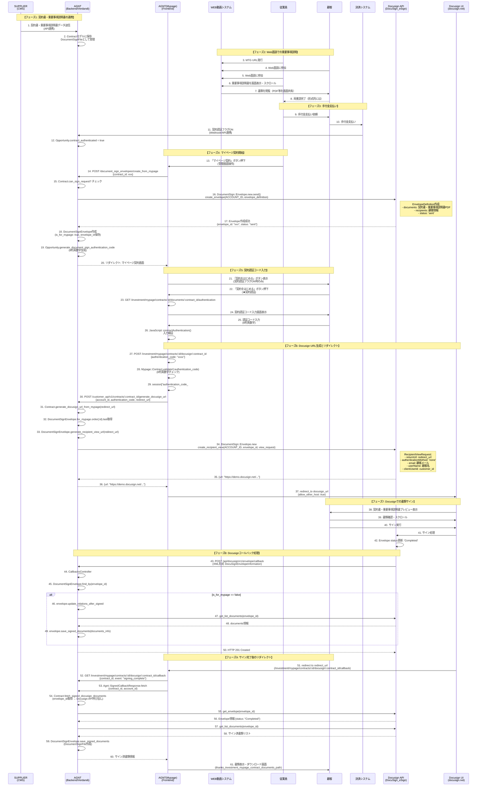

# Docusign連携詳細シーケンス図

## 概要

重要事項説明の必要書類交付における、Docusign API連携を含む詳細な業務シーケンス図です。

## 詳細シーケンス図

## 主要なAPIエンドポイント

### AGNT Backend (Verdandi)

1. **契約書作成（マイページ用）**
   - `POST /document_sign_envelopes/create_from_mypage`
   - パラメータ: `{contract_id: xxx}`
   - 処理: Docusign Envelope作成、認証コード生成

2. **Docusign URL生成**
   - `POST /customer_api/v1/contracts/:contract_id/generate_docusign_url`
   - パラメータ: `{account_id, authentication_code, redirect_url}`
   - レスポンス: `{url: "https://demo.docusign.net/..."}`

3. **Docusignコールバック**
   - `POST /api/docusign/v1/envelope/callback`
   - 形式: XML (DocuSignEnvelopeInformation)
   - 処理: Envelope status更新、サイン済書類保存

### AGNT Frontend (Mypage)

1. **契約認証画面**
   - `GET /investment/mypage/contracts/:id/documents/:contract_id/authentication`
   - 画面: 認証コード入力フォーム

2. **Docusign開始**
   - `POST /investment/mypage/contracts/:id/docusign/:contract_id`
   - パラメータ: `{authentication_code: "xxxx"}`

3. **Docusignコールバック処理**
   - `GET /investment/mypage/contracts/:id/docusign/:contract_id/callback`
   - パラメータ: `{contract_id, event}`

### Docusign API

1. **Envelope作成**
   - `POST /v2.1/accounts/{accountId}/envelopes`
   - メソッド: `DocumentSign::Envelope#send()`
   - 処理: `@envelopes_api.create_envelope(ACCOUNT_ID, envelope_definition)`

2. **Recipient View URL生成**
   - `POST /v2.1/accounts/{accountId}/envelopes/{envelopeId}/views/recipient`
   - メソッド: `DocumentSign::Envelope#generate_recipient_view_url()`
   - 処理: `@envelopes_api.create_recipient_view(ACCOUNT_ID, envelope_id, view_request)`

3. **Envelope情報取得**
   - `GET /v2.1/accounts/{accountId}/envelopes/{envelopeId}`
   - メソッド: `DocumentSign::Envelope#get()`

4. **書類リスト取得**
   - `GET /v2.1/accounts/{accountId}/envelopes/{envelopeId}/documents`
   - メソッド: `DocumentSign::Envelope#get_list_documents()`

## データフロー

### 契約書・重要事項説明書の流れ

1. **SUPPLIER → AGNT Backend**
   - SUPPLIERから契約書・重要事項説明書のPDFデータが送信される
   - AGNT Backendの`Contract`モデルに保存
   - `DocumentSignFile`として管理

2. **AGNT Backend → Docusign**
   - `DocumentSign::Envelope#send()`でEnvelope作成
   - PDFをBase64エンコードして`EnvelopeDefinition.documents`に設定
   - 顧客情報を`Recipients.signers`に設定

3. **Docusign → 顧客**
   - `create_recipient_view()`で生成されたURLにリダイレクト
   - 顧客がDocusign UIで書類を確認・サイン

4. **Docusign → AGNT Backend**
   - コールバック（XML形式）でサイン完了を通知
   - `get_list_documents()`でサイン済書類を取得
   - `DocumentSignFile`として保存

5. **AGNT Backend → AGNT Frontend**
   - サイン済書類をマイページで表示・ダウンロード可能にする

## 認証フロー

### 契約認証コード

1. **生成タイミング**
   - `create_from_mypage`実行時
   - `Opportunity.generate_document_sign_authentication_code`で8桁英数字を生成

2. **検証タイミング**
   - 顧客が「契約をはじめる」ボタン押下時
   - `Mypage::Contract.validate!(:authentication_code)`で検証
   - セッションに保存: `session["authentication_code_#{opportunity_id}"]`

3. **使用タイミング**
   - `generate_docusign_url` API呼び出し時に`authentication_code`パラメータとして送信
   - AGNT Backendで認証コードと契約IDの整合性を確認

## エラーハンドリング

### 認証コードエラー

- **形式エラー**: `ActiveModel::ValidationError` → 認証画面にリダイレクト（エラーメッセージ表示）
- **認証失敗**: `Agnt::ApiClient::Unauthorized` → 認証画面にリダイレクト（「確認コードが一致しません」）

### Docusign APIエラー

- **API呼び出し失敗**: `Agnt::ApiClient::ApiError` → エラーメッセージ表示、前の画面に戻る
- **コールバックエラー**: `StandardError` → Slack通知、HTTP 500返却

## 関連ファイル

### Backend (Verdandi)

- `app/models/contract.rb` - Contractモデル（Docusign連携ロジック）
- `app/models/document_sign_envelope.rb` - Envelopeモデル
- `app/controllers/document_sign_envelopes_controller.rb` - Envelope作成コントローラー
- `app/controllers/api/docusign/v1/envelope/callbacks_controller.rb` - コールバック処理
- `lib/document_sign/envelope.rb` - Docusign APIクライアント
- `config/routes.rb` - ルーティング定義

### Frontend (Mypage)

- `app/controllers/investment/mypage/contracts/docusign_controller.rb` - Docusignコントローラー
- `app/models/agnt/generate_docusign_url_response.rb` - URL生成APIクライアント
- `app/views/investment/mypage/contracts/documents/authentication.html.erb` - 認証画面
- `frontend/src/js/views/mypage/_contract_authentication.ts` - 認証コード入力検証

---

**作成日**: 2025-11-27  
**最終更新**: 2025-11-27  
**作成者**: {{env.USER_EMAIL}}

