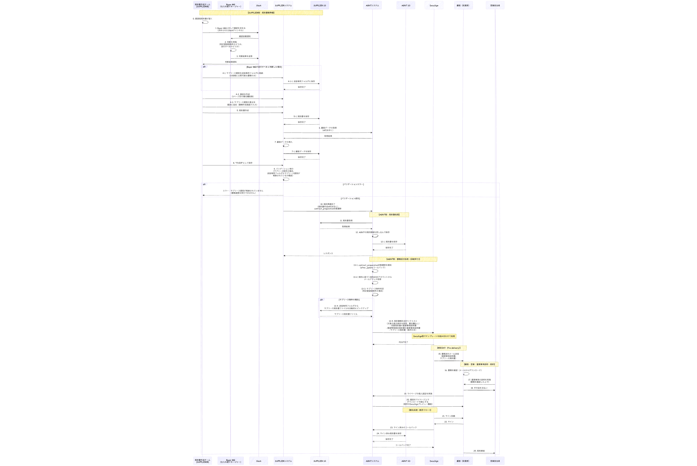
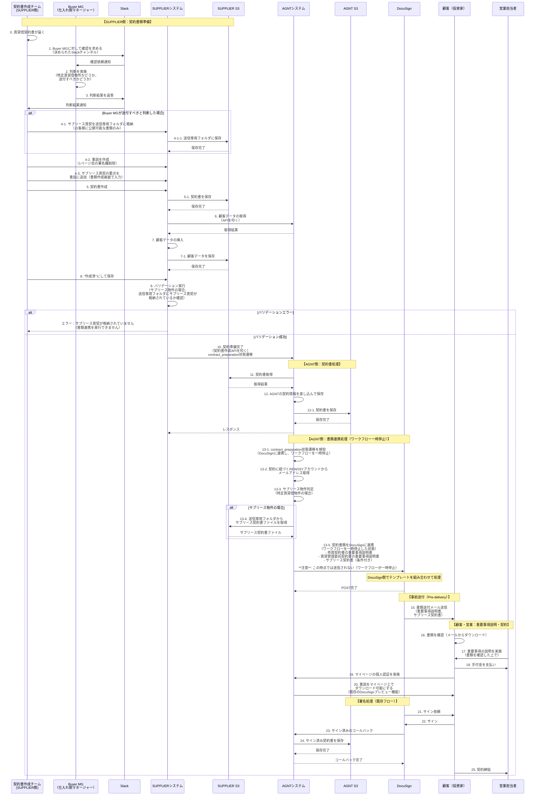

# ソリューション定義書

**プロジェクト名**: AGNT 2026 重要事項説明前の必要書類送付

追加要件については[追加要件定義書](./additional_requirements_2025-12-18.md)を参照してください。

## 1. 概要
本ソリューションは、SUPから契約書情報が連携されたタイミングで、DocuSignのワークフロー制御機能を利用したメール送信により、重要事項説明書とサブリース契約書を顧客に事前送付する機能を実装します。

**詳細な実装要件**: [DocuSign開発要件定義書](https://ga-tech.atlassian.net/wiki/spaces/AGNT/pages/5220368412/AGNT+2026) を参照してください。

## 2. ソリューションの目的
「重要事項説明書（売買、賃貸借契約）、サブリース契約書を重要事項説明よりも前に顧客に交付してあること」という法的要件を満たす状態を実現します。

**プロジェクト全体状況**: [プロジェクト全体状況](./project_overall_status.md) を参照してください。

## 3. 機能仕様詳細

### 3.1 送信先
**RENOSYアカウントのメールアドレス**
当該契約が存在する「案件」に紐づいた「RENOSYアカウント」のメールアドレスに対して送信します。

- **理由**: メール送信で対応するにあたって、本人性の担保を行うためです。契約に進む前に犯収法フォームで本人確認をしているため、RENOSYアカウントに対して送信することで本人確認済みとみなします。

### 3.2 送信トリガーとワークフロー
- **事前送付（重説のみ）**: SUPでの契約準備完了時にトリガー。全てのドキュメントを連携するが、ワークフロー機能で本送付を**一時停止**する。
- **本送付（重説以外）**: AGNT契約詳細から「マイページ契約」ボタン押下時にトリガー。一時停止していたワークフローを**解除**し、残りの書類を送信する。
- **閲覧制御**: 契約詳細ページを開いた際に `listRecipients` APIで重説の閲覧ステータスを確認し、未完了なら契約ボタンを無効化する。

**詳細な技術要件**: [DocuSign開発要件定義書](https://ga-tech.atlassian.net/wiki/spaces/AGNT/pages/5220368412/AGNT+2026)（エンジニア作成）を参照してください。

### 3.3 送信内容
- **重要事項説明書**: 署名印字（座標指定）を削除し、確認のみ可能な状態で送付。
- **契約書等**: ワークフロー再開後に送付。

### 3.4 送信対象書類の制御
以下の書類を動的に組み合わせます。

- **必須**: 売買契約書の重要事項説明書
- **必須**: 賃貸管理委託契約書の重要事項説明書（プランに応じたテンプレートを選択）
- **条件付き**: サブリース契約書（特定賃貸借物件フラグ、またはファイル存在チェックにより判定）

**送信対象外**:
- 売買契約書、賃貸管理委託契約書、クーリングオフ説明、個人情報取り扱い説明、領収書などは、本フェーズでは送信しません（既存の署名フローで送付）。

### 3.5 送信トリガーの実装

以下の実装方針となります。

- **事前送付（重説のみ）**: SUPでの契約準備完了時に、すべてのドキュメントを設定してDocuSignに連携するが、**自動送信ではなく、ワークフロー機能によって本送付を一時停止した状態にする**
- **本送付（重説以外すべて）**: AGNT契約詳細から「マイページ契約」押下時に、一時停止したワークフローを停止解除することで契約書などが送信される

**追加要件**: 2025-12-18に追加要件が確定し、「事前交付ボタン」を追加して重説担当者が手動で押下して送信する方式に変更（詳細は[追加要件定義書](./additional_requirements_2025-12-18.md)を参照）

- **要件**:
  - `contract_preparation`（契約書類準備完了）状態への遷移をトリガーとして、DocuSignに連携するが、**自動送信は行わない**
  - ワークフローを一時停止した状態にする
  - 案件（Opportunity）に紐づくRENOSYアカウントのメールアドレスに対し送信すること。

### 3.6 メール本文テンプレート

### 3.7 メール本文テンプレート

**件名**: 【RENOSY】重要事項説明書のご案内

```text
{お客様氏名}様

この度はお申し込みいただき誠にありがとうございます。

重要事項説明書を事前にご確認いただくため、こちらのDocuSignよりお送りいたします。

重要事項説明書は、契約締結前にお客様に交付する必要がある書類です。
事前にご確認いただくことで、重要事項説明の際により詳しくご質問いただくことができ、ご理解を深めていただけます。

なお、後日改めて弊社から重要事項説明を実施させていただきます。

何卒宜しくお願いいたします。
```

## 4. エラーハンドリングと対応方針

リトライ処理ではなく、Rollbarでエラーを検知して対処する方針とします。

- **メールアドレスが選択されていない**: 発生しない想定（RENOSYアカウントは必ず1つ紐づくため）。
- **メールアドレスが存在しない**: 発生しない想定（アドレス変更時も確認プロセスがあるため）。
- **受信者側からメールバウンス**: 一定数発生する可能性があります。エラー検知後、担当営業に連携します。
- **送信エラー（API利用量制限など）**: インシデントとして対応します。

### 4.1 エラーハンドリングの実装要件
- **Rollbar連携**: APIエラー、データ不整合エラー発生時にログを記録。
- **営業通知**: 送信失敗時、担当営業に通知を行う（仕組みの検討が必要）。
- **リトライ**: 基本的にリトライは行わず、エラー原因を解消してから手動またはバッチでの再送を検討（要運用設計）。

### 4.2 リスク管理
- **API制限**: コール数の増加に注意。
- **ワークフロー設定ミス**: 一時停止が正しく機能しないと、重説と契約書が同時に送信されてしまうため、設定検証を徹底する。
- **アドレス不在**: RENOSYアカウントが紐づいていないケースの考慮（例外発生させるか、スキップするか）。

### 4.3 運用要件
- **ログ記録**: 送信日時、送信先、送信内容を記録する。
- **エラー対応**: エラーログを確認し、担当営業へ連絡するフローを確立する。
- **再送付**: 電子証明書変更時などの再送付要件を確認する。

## 5. 対象業務の全体像

### 5.1 業務フロー概要図



### 5.2 業務フロー図（シーケンス図）



## 6. 現行フローからの変更点

| 項目 | 現状 | 変更後 |
| :--- | :--- | :--- |
| **送信トリガー** | 契約認証後（電子契約開始→SMS認証完了） | 契約書類準備完了時（SUP連携時）にDocuSignに連携し、ワークフローを一時停止<br/>実際の送信は「事前交付ボタン」または「マイページ契約」ボタン押下時 |
| **重説の署名欄** | あり | なし（事前送付用テンプレートを使用） |
| **提供方法** | マイページ上でダウンロード | DocuSignによるメール送信 |
| **サブリース契約書** | システム的な送付フローなし | 特定賃貸借物件の場合、自動送付対象に追加 |

## 6. 技術仕様

### 6.1 認証
- **認証レベル**: A（2要素認証）
- **認証方法**: 2要素認証
- **理由**: 契約書類を取り扱うため高度なセキュリティが必要です。

### 6.2 開発・リリース方針
- **開発方針**: リスク対応案件であるため、QAによるシナリオテストを実施し、不備がないことを検証した上でリリースします。
- **対象外スコープ**:
    - リリース以前に契約締結された書類については、再交付を行いません。
    - リリース時点で「契約締結前かつ契約書準備完了」の案件は、事前交付の対象とします。

## 7. 影響範囲

### 7.1 影響を受けるシステム
- **toC**: 投資マイページ、物件マイページ
- **to社内**: SUPPLIER、AGNT
- **横断・基盤**: PEOPLE、RENOSY ACCOUNT

### 7.2 主要な実装ファイル（想定）
- **高影響度**:
    - `verdandi/lib/document_sign/envelope.rb`: メール送信処理の追加、署名欄制御
    - `verdandi/app/models/contract.rb`: トリガー実装、アドレス取得
- **新規作成**:
    - DocuSign連携処理の実装（具体的なクラス名・ファイル名は実装時に決定）

### 7.3 追加確認事項
開発着手前に以下の点を確認する必要があります。
1. **連携タイミング**: SUPからAGNTへの契約書情報連携の正確なタイミング
2. **アドレス取得**: 案件（Opportunity）からRENOSYアカウントのメールアドレスを取得する具体的なロジック
3. **サブリース判定**: 特定賃貸借物件の判定ロジックと、SUPPLIER側でのフラグ管理
4. **ワークフローAPI**: DocuSignのワークフロー一時停止・再開APIの仕様確認

**詳細な技術要件**: [DocuSign開発要件定義書](https://ga-tech.atlassian.net/wiki/spaces/AGNT/pages/5220368412/AGNT+2026)（エンジニア作成）を参照してください。

### 7.4 テスト要件

#### 単体テスト
- **Contractモデル**: コールバックが正しいタイミングで発火すること。
- **Envelope**: エンベロープ定義が正しく生成されること（特にワークフロー設定、Recipient設定）。

#### 統合テスト
- **SUPPLIER連携**: 契約書連携完了ステータス変更時に送信処理が走ること。
- **DocuSign連携**: 実際にメールが送信され、重説のみが届き、ワークフローが一時停止されること。
- **ワークフロー再開**: 「マイページ契約」押下時にワークフローが再開され、残りの書類が送信されること。
- **閲覧制御**: `listRecipients` APIでステータスを確認し、未閲覧時は契約ボタンが無効化されること。

## 8. リスクと対策

| リスク | 対策 |
| :--- | :--- |
| **メール見落とし** | 営業担当からのフォローフローを構築 |
| **メールバウンス** | Rollbar検知 → 担当営業へ自動連携（または手動連携） |
| **API制限** | APIコール数の監視、インシデント対応体制の準備 |

## 9. 成功基準
- [ ] 契約書類準備完了をトリガーに、重要事項説明よりも前に書類を送付できること
- [ ] サブリース契約書の送付フローが実装されていること（特定賃貸借物件の場合）
- [ ] エラーハンドリングが実装され、異常時に検知できること
- [ ] 月間1000契約以上の規模でも遅延なく稼働すること

---

**作成者**: 佐藤達也  
**作成日**: 2025-11-18  
**最終更新**: 2025-12-11（構成整理・重複排除）  
**バージョン**: v1.3
