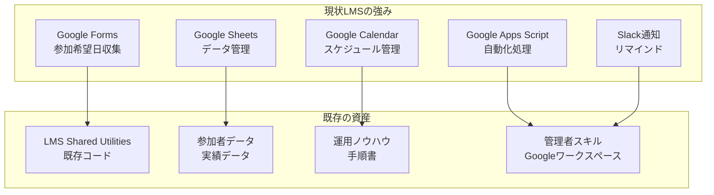
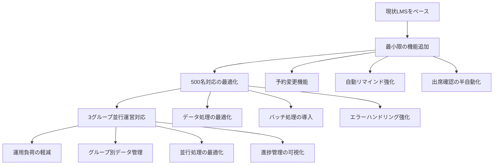
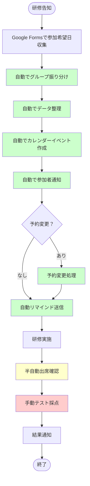

# 現状LMS活用 最小改善案

## 1. 現状LMSの評価

### 1.1 現状システムの強み



### 1.2 現状で対応可能な範囲

| 機能 | 現状での対応 | 500名対応 | 3グループ対応 |
|------|-------------|-----------|---------------|
| **参加希望日収集** | Google Forms | ✅ 可能 | ✅ 可能 |
| **データ管理** | Google Sheets | ✅ 可能 | ✅ 可能 |
| **スケジュール管理** | Google Calendar | ✅ 可能 | ✅ 可能 |
| **通知機能** | Slack通知 | ✅ 可能 | ✅ 可能 |
| **出席確認** | 手動確認 | ⚠️ 負荷大 | ⚠️ 負荷大 |

## 2. 最小改善案：現状LMS + 軽微な拡張

### 2.1 改善の基本方針



### 2.2 具体的な改善内容

#### 2.2.1 既存Google Apps Scriptの拡張

```javascript
// 現状のLMS Shared Utilitiesを拡張
class EnhancedLMSUtils extends LMSUtils {
  constructor() {
    super();
    this.maxParticipants = 500;
    this.groupCount = 3;
  }
  
  // 500名対応のデータ処理
  processLargeDataset(data, batchSize = 100) {
    const results = [];
    for (let i = 0; i < data.length; i += batchSize) {
      const batch = data.slice(i, i + batchSize);
      const processed = this.processBatch(batch);
      results.push(...processed);
      
      // 実行時間制限対策
      if (i % 500 === 0) {
        Utilities.sleep(100);
      }
    }
    return results;
  }
  
  // 3グループ並行運営対応
  assignToGroups(participants) {
    const groups = { 1: [], 2: [], 3: [] };
    const groupSize = Math.ceil(participants.length / 3);
    
    participants.forEach((participant, index) => {
      const groupNumber = Math.floor(index / groupSize) + 1;
      if (groupNumber <= 3) {
        groups[groupNumber].push(participant);
      }
    });
    
    return groups;
  }
  
  // 予約変更機能（新規追加）
  changeReservation(participantId, oldSessionId, newSessionId) {
    try {
      // 変更条件チェック
      if (!this.canChangeReservation(participantId, oldSessionId)) {
        return { success: false, message: '変更条件を満たしていません' };
      }
      
      // 元の予約をキャンセル
      this.cancelReservation(participantId, oldSessionId);
      
      // 新しい予約を作成
      this.createReservation(participantId, newSessionId);
      
      // カレンダー更新
      this.updateCalendarEvent(oldSessionId, newSessionId, participantId);
      
      return { success: true, message: '予約変更が完了しました' };
    } catch (error) {
      console.error('予約変更エラー:', error);
      return { success: false, message: '予約変更に失敗しました' };
    }
  }
  
  // 自動リマインド強化
  sendEnhancedReminders() {
    const tomorrow = new Date();
    tomorrow.setDate(tomorrow.getDate() + 1);
    
    const sessions = this.getSessionsByDate(tomorrow);
    
    sessions.forEach(session => {
      const participants = this.getSessionParticipants(session.id);
      
      // バッチ処理でリマインド送信
      this.processBatch(participants, 50, (batch) => {
        batch.forEach(participant => {
          this.sendReminderEmail(participant, session);
        });
      });
    });
  }
}
```

#### 2.2.2 Google Sheetsの構造最適化

```javascript
// 500名・3グループ対応のシート構造
const OPTIMIZED_SHEET_STRUCTURE = {
  // 受講者管理（グループ別）
  Participants: {
    columns: [
      'ID', 'Name', 'Email', 'Department', 'Group_ID', 
      'Status', 'Created_At', 'Updated_At'
    ],
    groupDistribution: {
      1: 'A2:H167',    // グループ1: 1-167行
      2: 'A168:H334',  // グループ2: 168-334行
      3: 'A335:H500'   // グループ3: 335-500行
    }
  },
  
  // 研修セッション（グループ別）
  Sessions: {
    columns: [
      'ID', 'Group_ID', 'Session_Name', 'Scheduled_Date',
      'Start_Time', 'End_Time', 'Meeting_Room', 'Max_Participants',
      'Current_Participants', 'Status'
    ],
    groupSessions: {
      1: 'A2:J50',   // グループ1のセッション
      2: 'A51:J100', // グループ2のセッション
      3: 'A101:J150' // グループ3のセッション
    }
  },
  
  // 予約管理（全グループ統合）
  Reservations: {
    columns: [
      'ID', 'Participant_ID', 'Session_ID', 'Group_ID',
      'Status', 'Change_Count', 'Created_At', 'Updated_At'
    ],
    maxRows: 2000 // 予約変更も考慮
  }
};
```

### 2.3 運用フローの最適化

#### 2.3.1 現状フロー + 最小改善



#### 2.3.2 改善ポイント

| 現状 | 改善後 | 効果 |
|------|--------|------|
| 手動グループ振り分け | 自動振り分け | 時間削減、ミス防止 |
| 手動データ整理 | 自動データ整理 | 時間削減、一貫性向上 |
| 手動カレンダー更新 | 自動カレンダー更新 | 時間削減、リアルタイム更新 |
| 手動通知 | 自動通知 | 時間削減、確実性向上 |
| 予約変更不可 | 予約変更可能 | 利便性向上 |
| 手動リマインド | 自動リマインド | 時間削減、確実性向上 |
| 手動出席確認 | 半自動出席確認 | 時間削減、精度向上 |
| 手動採点 | 手動採点（現状維持） | 現状維持 |

## 3. 実装計画（最小限）

### 3.1 Phase 1: 基盤拡張（1週間）
- [ ] 既存LMS Shared Utilitiesの拡張
- [ ] 500名対応のデータ処理最適化
- [ ] 3グループ自動振り分け機能

### 3.2 Phase 2: 機能追加（1週間）
- [ ] 予約変更機能の追加
- [ ] 自動リマインド機能の強化
- [ ] 半自動出席確認機能

### 3.3 Phase 3: 運用最適化（1週間）
- [ ] エラーハンドリングの強化
- [ ] バッチ処理の最適化
- [ ] 運用マニュアルの更新

## 4. コスト・工数

### 4.1 開発コスト
- **開発期間**: 3週間（最小限）
- **開発工数**: 1人×3週間
- **追加コスト**: $0（既存Googleワークスペース活用）

### 4.2 運用コスト
- **月額コスト**: $0（既存システム活用）
- **運用工数**: 現状の50%削減
- **メンテナンス**: 既存スキルで対応可能

## 5. 期待される効果

### 5.1 定量的効果
- **作業時間削減**: 50%削減（10時間/回 → 5時間/回）
- **エラー削減**: 自動化により大幅削減
- **スケーラビリティ**: 500名・3グループ対応可能

### 5.2 定性的効果
- **現状システムの活用**: 既存資産を最大限活用
- **段階的改善**: リスクを最小限に抑制
- **学習コスト最小**: 既存スキルで対応可能

## 6. リスクと対策

### 6.1 リスク
- **既存システムへの影響**: 最小限の変更で影響を抑制
- **データ移行**: 既存データをそのまま活用
- **運用変更**: 段階的な移行で混乱を防止

### 6.2 対策
- **段階的実装**: 機能ごとに段階的に実装
- **既存データ保持**: 既存のデータ構造を維持
- **運用継続**: 現状の運用を継続しながら改善

---

**結論**: 現状のLMSをベースに最小限の改善で500名・3グループ並行運営に対応可能。既存資産を活用し、リスクを最小限に抑制した実用的なアプローチ。

---

**作成日**: 2024年10月17日  
**バージョン**: 1.0  
**対象**: 現状LMS活用 最小改善案  
**方針**: 既存システム活用 + 最小限の機能追加
