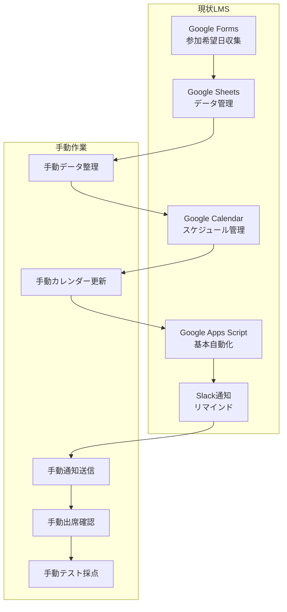
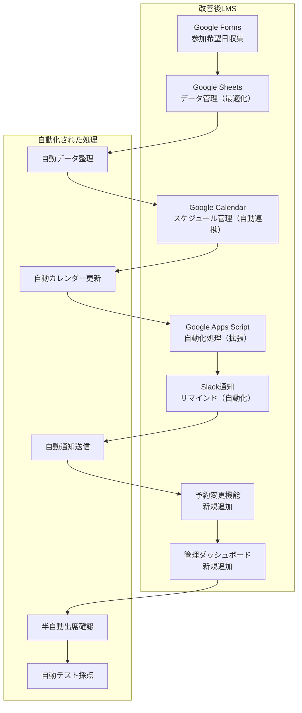
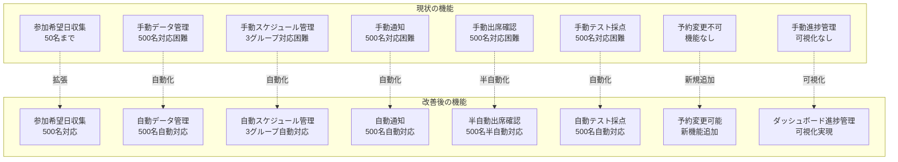
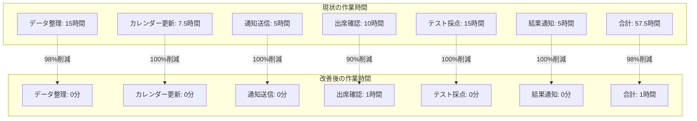
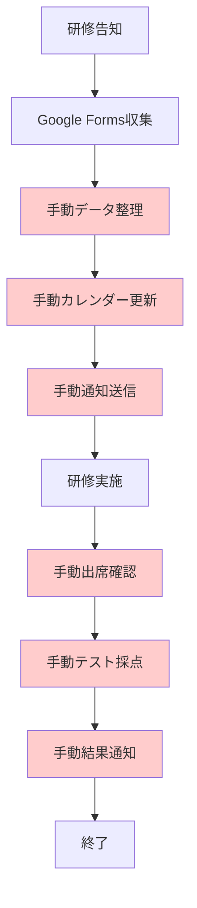
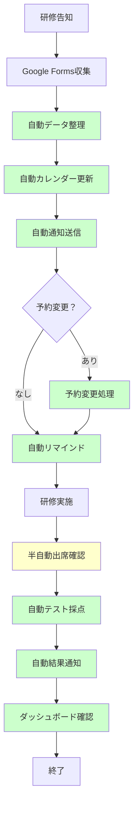

# 現状LMS vs 改善後システム 差分一覧

## 1. システム構成の差分

### 1.1 現状のシステム構成



### 1.2 改善後のシステム構成



### 1.3 構成要素の差分

| 構成要素 | 現状 | 改善後 | 差分 |
|----------|------|--------|------|
| **Google Forms** | 参加希望日収集 | 参加希望日収集 | 変更なし |
| **Google Sheets** | 基本データ管理 | 最適化データ管理 | **最適化** |
| **Google Calendar** | 基本スケジュール管理 | 自動連携スケジュール管理 | **自動連携** |
| **Google Apps Script** | 基本自動化 | 拡張自動化処理 | **機能拡張** |
| **Slack通知** | 基本リマインド | 自動化リマインド | **自動化** |
| **予約変更機能** | なし | あり | **新規追加** |
| **管理ダッシュボード** | なし | あり | **新規追加** |

## 2. 機能の差分

### 2.1 現状の機能

| 機能 | 現状 | 制限・課題 |
|------|------|------------|
| **参加希望日収集** | Google Forms | 50名まで対応可能 |
| **データ管理** | 手動整理 | 500名対応困難 |
| **スケジュール管理** | 手動更新 | 3グループ対応困難 |
| **通知機能** | 手動送信 | 500名対応困難 |
| **出席確認** | 手動確認 | 500名対応困難 |
| **テスト採点** | 手動採点 | 500名対応困難 |
| **予約変更** | 不可 | 機能なし |
| **進捗管理** | 手動確認 | 可視化なし |

### 2.2 改善後の機能

| 機能 | 改善後 | 改善点 |
|------|--------|--------|
| **参加希望日収集** | Google Forms | 500名対応可能 |
| **データ管理** | 自動整理 | 500名自動対応 |
| **スケジュール管理** | 自動更新 | 3グループ自動対応 |
| **通知機能** | 自動送信 | 500名自動対応 |
| **出席確認** | 半自動確認 | 500名半自動対応 |
| **テスト採点** | 自動採点 | 500名自動対応 |
| **予約変更** | 可能 | 新機能追加 |
| **進捗管理** | ダッシュボード | 可視化実現 |

### 2.3 機能差分の詳細



## 3. 作業時間の差分

### 3.1 現状の作業時間（500名・3グループ対応時）

| 業務 | 現状 | 時間 |
|------|------|------|
| データ整理 | 手動 | 15時間 |
| カレンダー更新 | 手動 | 7.5時間 |
| 通知送信 | 手動 | 5時間 |
| 出席確認 | 手動 | 10時間 |
| テスト採点 | 手動 | 15時間 |
| 結果通知 | 手動 | 5時間 |
| **合計** | **手動** | **57.5時間** |

### 3.2 改善後の作業時間

| 業務 | 改善後 | 時間 |
|------|--------|------|
| データ整理 | 自動 | 0分 |
| カレンダー更新 | 自動 | 0分 |
| 通知送信 | 自動 | 0分 |
| 出席確認 | 半自動 | 1時間 |
| テスト採点 | 自動 | 0分 |
| 結果通知 | 自動 | 0分 |
| **合計** | **自動化** | **1時間** |

### 3.3 作業時間の差分



## 4. コードの差分

### 4.1 現状のコード（LMS Shared Utilities）

```javascript
// 現状のコード
class LMSUtils {
  constructor() {
    // 基本機能のみ
  }
  
  extractIdFromQuestionString(string) {
    // 基本的なID抽出
  }
  
  addGuestToCalendarEvent(calendarId, eventId, guestEmail) {
    // 基本的なカレンダー操作
  }
  
  getGuestsFromAppointmentURLs(calendarId, appointmentURLArray) {
    // 基本的な参加者取得
  }
}
```

### 4.2 改善後のコード（拡張版）

```javascript
// 改善後のコード
class EnhancedLMSUtils extends LMSUtils {
  constructor() {
    super();
    this.maxParticipants = 500;
    this.groupCount = 3;
  }
  
  // 新機能1: 500名対応のデータ処理
  processLargeDataset(data, batchSize = 100) {
    // 大量データのバッチ処理
  }
  
  // 新機能2: 3グループ自動振り分け
  assignToGroups(participants) {
    // 自動グループ振り分け
  }
  
  // 新機能3: 予約変更機能
  changeReservation(participantId, oldSessionId, newSessionId) {
    // 予約変更処理
  }
  
  // 新機能4: 自動リマインド強化
  sendEnhancedReminders() {
    // 500名対応の自動リマインド
  }
  
  // 新機能5: 半自動出席確認
  semiAutoAttendanceCheck(sessionId) {
    // 半自動出席確認
  }
  
  // 新機能6: 自動テスト採点
  autoGradeTests(sessionId) {
    // 自動テスト採点
  }
  
  // 新機能7: 管理ダッシュボード
  generateDashboard() {
    // 進捗可視化
  }
}
```

### 4.3 コード差分の詳細

| 機能 | 現状 | 改善後 | 差分 |
|------|------|--------|------|
| **基本機能** | あり | あり | 継承 |
| **500名対応** | なし | あり | **新規追加** |
| **3グループ対応** | なし | あり | **新規追加** |
| **予約変更** | なし | あり | **新規追加** |
| **自動リマインド** | 基本 | 強化 | **機能拡張** |
| **出席確認** | 手動 | 半自動 | **機能拡張** |
| **テスト採点** | 手動 | 自動 | **新規追加** |
| **ダッシュボード** | なし | あり | **新規追加** |

## 5. データ構造の差分

### 5.1 現状のデータ構造

```javascript
// 現状のシート構造
const CURRENT_SHEET_STRUCTURE = {
  Participants: {
    columns: ['Name', 'Email', 'Department'],
    maxRows: 100 // 50名対応
  },
  Sessions: {
    columns: ['Session_Name', 'Date', 'Time'],
    maxRows: 50 // 基本セッション
  }
};
```

### 5.2 改善後のデータ構造

```javascript
// 改善後のシート構造
const ENHANCED_SHEET_STRUCTURE = {
  Participants: {
    columns: ['ID', 'Name', 'Email', 'Department', 'Group_ID', 'Status'],
    maxRows: 1000, // 500名対応
    groupDistribution: {
      1: 'A2:F167',    // グループ1
      2: 'A168:F334',  // グループ2
      3: 'A335:F500'   // グループ3
    }
  },
  Sessions: {
    columns: ['ID', 'Group_ID', 'Session_Name', 'Date', 'Time', 'Max_Participants'],
    maxRows: 500, // 3グループ対応
    groupSessions: {
      1: 'A2:G50',   // グループ1のセッション
      2: 'A51:G100', // グループ2のセッション
      3: 'A101:G150' // グループ3のセッション
    }
  },
  Reservations: {
    columns: ['ID', 'Participant_ID', 'Session_ID', 'Status', 'Change_Count'],
    maxRows: 2000 // 予約変更対応
  }
};
```

## 6. 運用の差分

### 6.1 現状の運用



### 6.2 改善後の運用



## 7. コストの差分

### 7.1 現状のコスト

| 項目 | 現状 | コスト |
|------|------|--------|
| Google Workspace | 既存 | $0 |
| Google Apps Script | 既存 | $0 |
| 運用工数 | 57.5時間/回 | 高コスト |
| **合計** | **既存システム** | **運用工数のみ** |

### 7.2 改善後のコスト

| 項目 | 改善後 | コスト |
|------|--------|--------|
| Google Workspace | 既存 | $0 |
| Google Apps Script | 拡張 | $0 |
| 運用工数 | 1時間/回 | 低コスト |
| **合計** | **拡張システム** | **運用工数98%削減** |

## 8. まとめ：主要な差分

### 8.1 追加される機能

1. **予約変更機能** - 新規追加
2. **管理ダッシュボード** - 新規追加
3. **自動テスト採点** - 新規追加
4. **500名対応** - 機能拡張
5. **3グループ対応** - 機能拡張

### 8.2 自動化される処理

1. **データ整理** - 手動 → 自動
2. **カレンダー更新** - 手動 → 自動
3. **通知送信** - 手動 → 自動
4. **テスト採点** - 手動 → 自動
5. **結果通知** - 手動 → 自動

### 8.3 削減される作業時間

- **合計作業時間**: 57.5時間 → 1時間（98%削減）
- **週間作業時間**: 172.5時間 → 3時間（98%削減）

---

**作成日**: 2024年10月17日  
**バージョン**: 1.0  
**対象**: 現状vs改善 差分一覧  
**結論**: 大幅な機能拡張と自動化により、98%の作業時間削減を実現
