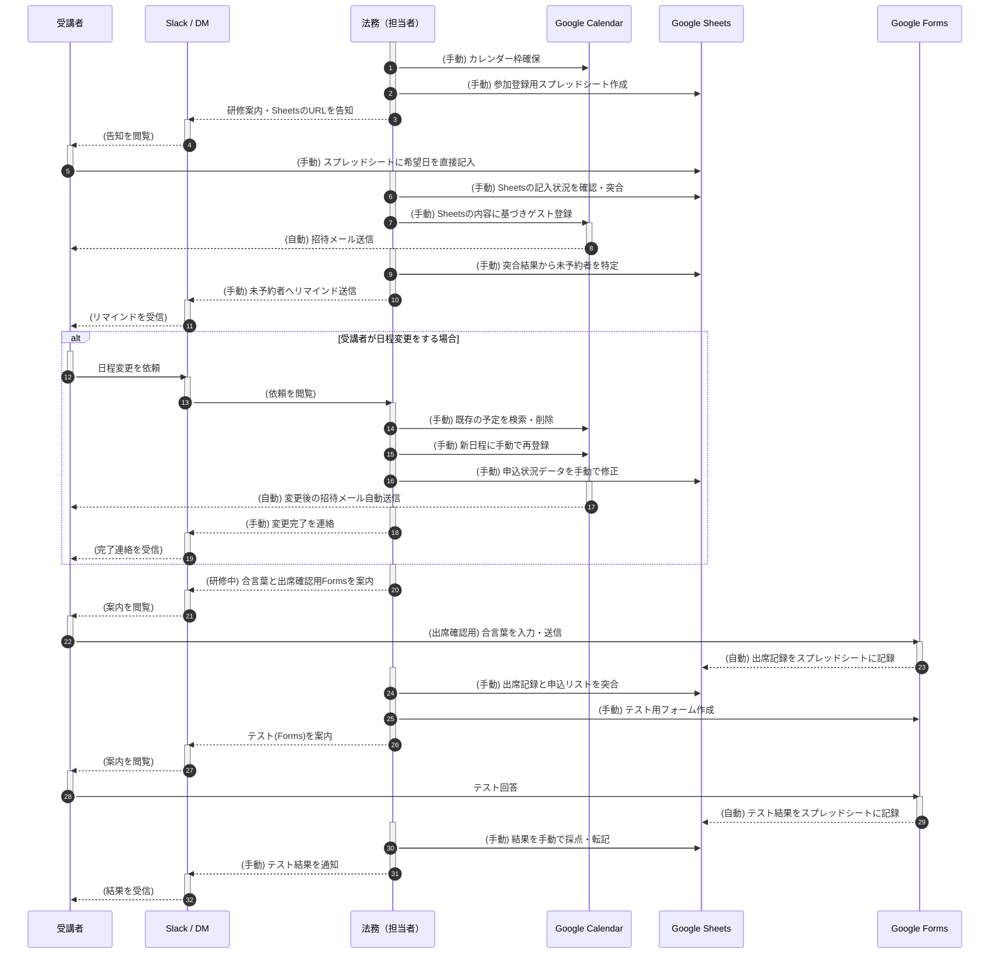

```mermaid
sequenceDiagram
    autonumber
    participant 受講者
    participant Slack / DM
    participant 法務（担当者）
    participant Google Calendar
    participant Google Sheets
    participant Google Forms

    activate 法務（担当者）
    法務（担当者）->>Google Calendar: (手動) カレンダー枠確保
    法務（担当者）->>Google Sheets: (手動) 参加登録用スプレッドシート作成
    deactivate 法務（担当者）

    activate 法務（担当者）
    法務（担当者）-->>Slack / DM: 研修案内・SheetsのURLを告知
    deactivate 法務（担当者）
    activate Slack / DM
    Slack / DM-->>受講者: (告知を閲覧)
    deactivate Slack / DM
    
    activate 受講者
    受講者->>Google Sheets: (手動) スプレッドシートに希望日を直接記入
    deactivate 受講者

    activate 法務（担当者）
    法務（担当者）->>Google Sheets: (手動) Sheetsの記入状況を確認・突合
    法務（担当者）->>Google Calendar: (手動) Sheetsの内容に基づきゲスト登録
    deactivate 法務（担当者）
    activate Google Calendar
    Google Calendar-->>受講者: (自動) 招待メール送信
    deactivate Google Calendar

    activate 法務（担当者）
    法務（担当者）->>Google Sheets: (手動) 突合結果から未予約者を特定
    法務（担当者）-->>Slack / DM: (手動) 未予約者へリマインド送信
    deactivate 法務（担当者）
    activate Slack / DM
    Slack / DM-->>受講者: (リマインドを受信)
    deactivate Slack / DM

    alt 受講者が日程変更をする場合
        activate 受講者
        受講者->>Slack / DM: 日程変更を依頼
        deactivate 受講者
        activate Slack / DM
        Slack / DM->>法務（担当者）: (依頼を閲覧)
        deactivate Slack / DM
        
        activate 法務（担当者）
        法務（担当者）->>Google Calendar: (手動) 既存の予定を検索・削除
        法務（担当者）->>Google Calendar: (手動) 新日程に手動で再登録
        法務（担当者）->>Google Sheets: (手動) 申込状況データを手動で修正
        deactivate 法務（担当者）
        
        activate Google Calendar
        Google Calendar-->>受講者: (自動) 変更後の招待メール自動送信
        deactivate Google Calendar
        
        activate 法務（担当者）
        法務（担当者）-->>Slack / DM: (手動) 変更完了を連絡
        deactivate 法務（担当者）
        activate Slack / DM
        Slack / DM-->>受講者: (完了連絡を受信)
        deactivate Slack / DM
    end

    activate 法務（担当者）
    法務（担当者）-->>Slack / DM: (研修中) 合言葉と出席確認用Formsを案内
    deactivate 法務（担当者）
    activate Slack / DM
    Slack / DM-->>受講者: (案内を閲覧)
    deactivate Slack / DM
    
    activate 受講者
    受講者->>Google Forms: (出席確認用) 合言葉を入力・送信
    deactivate 受講者
    
    activate Google Forms
    Google Forms-->>Google Sheets: (自動) 出席記録をスプレッドシートに記録
    deactivate Google Forms
    
    activate 法務（担当者）
    法務（担当者）->>Google Sheets: (手動) 出席記録と申込リストを突合
    deactivate 法務（担当者）

    activate 法務（担当者）
    法務（担当者）->>Google Forms: (手動) テスト用フォーム作成
    法務（担当者）-->>Slack / DM: テスト(Forms)を案内
    deactivate 法務（担当者）
    activate Slack / DM
    Slack / DM-->>受講者: (案内を閲覧)
    deactivate Slack / DM
    
    activate 受講者
    受講者->>Google Forms: テスト回答
    deactivate 受講者
    
    activate Google Forms
    Google Forms-->>Google Sheets: (自動) テスト結果をスプレッドシートに記録
    deactivate Google Forms
    
    activate 法務（担当者）
    法務（担当者）->>Google Sheets: (手動) 結果を手動で採点・転記
    deactivate 法務（担当者）

    activate 法務（担当者）
    法務（担当者）-->>Slack / DM: (手動) テスト結果を通知
    deactivate 法務（担当者）
    activate Slack / DM
    Slack / DM-->>受講者: (結果を受信)
    deactivate Slack / DM
```