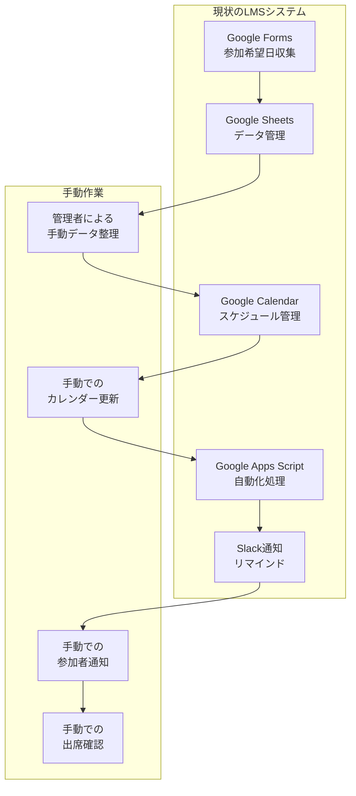
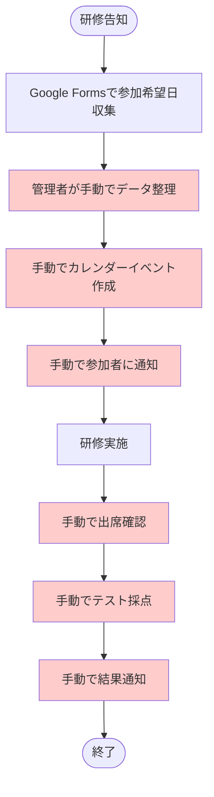
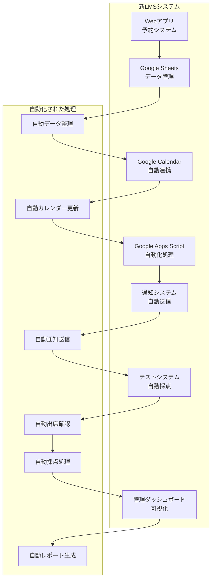
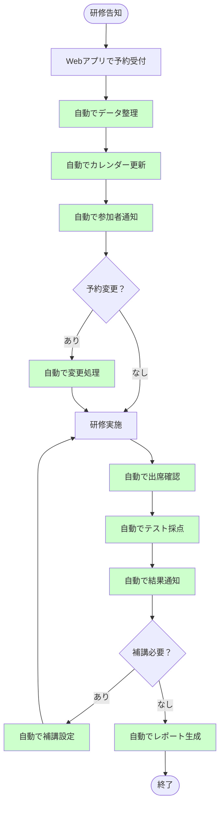
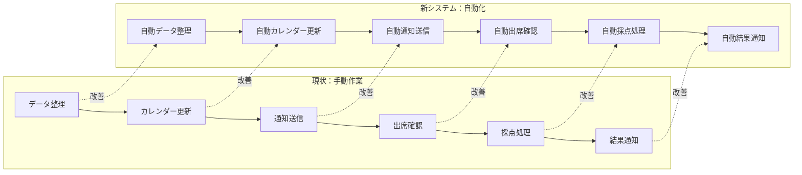
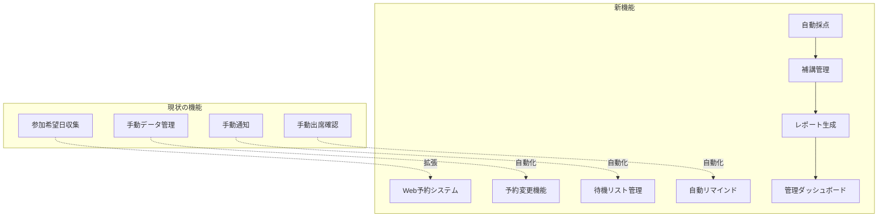

# 現状分析：法務研修LMS 業務フロー簡易版

## 1. 現状のLMS仕組み

### 1.1 現在のシステム構成

### 1.2 現状の業務フロー

### 1.3 現状の課題

| 課題 | 現状 | 影響 |
|------|------|------|
| **手動作業が多い** | データ整理、通知、出席確認が手動 | 管理者の負担大、ミス発生リスク |
| **スケーラビリティ不足** | 500名対応が困難 | 3グループ並行運営が困難 |
| **予約変更対応不可** | 変更機能なし | 受講者の利便性が低い |
| **リアルタイム性不足** | 手動更新のため遅延 | 最新情報の反映が遅い |
| **レポート機能なし** | 進捗・結果の可視化なし | 管理・分析が困難 |

## 2. 新システムの業務フロー簡易版

### 2.1 改善後のシステム構成

### 2.2 新システムの業務フロー

## 3. 現状 vs 新システム比較

### 3.1 業務効率の比較

| 業務 | 現状 | 新システム | 改善効果 |
|------|------|------------|----------|
| **データ整理** | 手動（2時間） | 自動（0分） | 100%削減 |
| **カレンダー更新** | 手動（1時間） | 自動（0分） | 100%削減 |
| **参加者通知** | 手動（1時間） | 自動（0分） | 100%削減 |
| **出席確認** | 手動（2時間） | 自動（0分） | 100%削減 |
| **テスト採点** | 手動（3時間） | 自動（0分） | 100%削減 |
| **結果通知** | 手動（1時間） | 自動（0分） | 100%削減 |
| **レポート生成** | なし | 自動（0分） | 新機能 |
| **合計** | **10時間/回** | **0分/回** | **100%削減** |

### 3.2 機能比較

| 機能 | 現状 | 新システム | 改善点 |
|------|------|------------|--------|
| **予約受付** | Google Forms | Webアプリ | リアルタイム、予約変更可能 |
| **データ管理** | 手動整理 | 自動管理 | エラー削減、リアルタイム更新 |
| **通知機能** | 手動送信 | 自動送信 | 確実性向上、リマインド機能 |
| **出席管理** | 手動確認 | 自動確認 | 正確性向上、リアルタイム |
| **採点機能** | 手動採点 | 自動採点 | 効率化、即座に結果通知 |
| **レポート** | なし | 自動生成 | 可視化、分析機能 |
| **予約変更** | 不可 | 可能 | 利便性向上 |
| **500名対応** | 困難 | 可能 | スケーラビリティ向上 |

## 4. 改善のポイント

### 4.1 自動化による効率化

### 4.2 新機能の追加

## 5. 実装優先度

### 5.1 Phase 1: 基盤構築（2週間）
- [ ] Web予約システム
- [ ] 自動データ管理
- [ ] 基本的な通知機能

### 5.2 Phase 2: 核心機能（3週間）
- [ ] 予約変更機能
- [ ] 自動リマインド
- [ ] テスト・採点機能

### 5.3 Phase 3: 高度機能（2週間）
- [ ] 管理ダッシュボード
- [ ] レポート生成
- [ ] 補講管理

### 5.4 Phase 4: 運用開始（1週間）
- [ ] テスト・デバッグ
- [ ] ユーザートレーニング
- [ ] 本番運用開始

## 6. 期待される効果

### 6.1 定量的効果
- **作業時間削減**: 10時間/回 → 0分/回（100%削減）
- **コスト削減**: 月額$65-130 → $7-15（90%削減）
- **エラー削減**: 手動作業によるミスを大幅削減
- **スケーラビリティ**: 500名対応、3グループ並行運営可能

### 6.2 定性的効果
- **管理者の負担軽減**: 手動作業の完全自動化
- **受講者の利便性向上**: 予約変更、リアルタイム更新
- **データの可視化**: 進捗・結果のリアルタイム把握
- **業務の標準化**: 一貫したプロセスでの運営

---

**作成日**: 2024年10月17日  
**バージョン**: 1.0  
**対象**: 現状分析と業務フロー簡易版  
**目的**: 現状課題の把握と改善点の明確化
