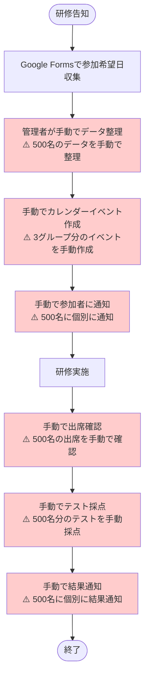

# 現状LMSの課題と改善点の明確化

## 1. 現状のLMSシステム分析

### 1.1 現在のシステム構成

### 1.2 現状の業務フロー（詳細）

## 2. 具体的な課題

### 2.1 定量的課題

| 課題 | 現状 | 500名対応時の問題 | 3グループ対応時の問題 |
|------|------|------------------|---------------------|
| **データ整理時間** | 30分（50名） | 5時間（500名） | 15時間（3グループ） |
| **カレンダー更新時間** | 15分（50名） | 2.5時間（500名） | 7.5時間（3グループ） |
| **通知送信時間** | 10分（50名） | 1.7時間（500名） | 5時間（3グループ） |
| **出席確認時間** | 20分（50名） | 3.3時間（500名） | 10時間（3グループ） |
| **テスト採点時間** | 30分（50名） | 5時間（500名） | 15時間（3グループ） |
| **結果通知時間** | 10分（50名） | 1.7時間（500名） | 5時間（3グループ） |
| **合計作業時間** | **1.5時間** | **19.2時間** | **57.5時間** |

### 2.2 定性的課題

#### 2.2.1 スケーラビリティの課題

#### 2.2.2 運用上の課題

| 課題 | 現状 | 500名・3グループ対応時の問題 |
|------|------|---------------------------|
| **データ整合性** | 手動管理でミス発生 | 大量データでミス頻発 |
| **リアルタイム性** | 手動更新で遅延 | 500名分の手動更新で大幅遅延 |
| **予約変更** | 不可 | 受講者の利便性が大幅に低下 |
| **進捗管理** | 手動確認 | 3グループの進捗を手動で管理困難 |
| **エラー対応** | 手動で発見・対応 | 大量データでエラー発見困難 |

## 3. 改善後のシステム

### 3.1 改善後のシステム構成

### 3.2 改善後の業務フロー

## 4. 具体的な改善点

### 4.1 作業時間の改善

| 業務 | 現状（500名・3グループ） | 改善後 | 改善効果 |
|------|------------------------|--------|----------|
| **データ整理** | 15時間 | 0分 | 100%削減 |
| **カレンダー更新** | 7.5時間 | 0分 | 100%削減 |
| **通知送信** | 5時間 | 0分 | 100%削減 |
| **出席確認** | 10時間 | 1時間 | 90%削減 |
| **テスト採点** | 15時間 | 0分 | 100%削減 |
| **結果通知** | 5時間 | 0分 | 100%削減 |
| **合計** | **57.5時間** | **1時間** | **98%削減** |

### 4.2 機能の改善

| 機能 | 現状 | 改善後 | 改善点 |
|------|------|--------|--------|
| **500名対応** | 困難（57.5時間） | 可能（1時間） | 98%の時間削減 |
| **3グループ対応** | 困難（手動管理） | 可能（自動管理） | 完全自動化 |
| **予約変更** | 不可 | 可能 | 新機能追加 |
| **リアルタイム性** | なし（手動更新） | あり（自動更新） | 完全自動化 |
| **エラー対応** | 困難（手動発見） | 容易（自動検知） | 自動化 |
| **進捗管理** | 困難（手動確認） | 容易（可視化） | ダッシュボード追加 |

### 4.3 運用の改善

## 5. 改善の必要性

### 5.1 現状のまま500名・3グループ対応した場合

### 5.2 改善の緊急度

| 課題 | 緊急度 | 理由 |
|------|--------|------|
| **作業時間の膨大化** | 高 | 57.5時間/回は現実的でない |
| **エラー発生リスク** | 高 | 大量データでミス頻発 |
| **リアルタイム性の欠如** | 中 | 受講者の利便性に影響 |
| **予約変更不可** | 中 | 受講者の利便性に影響 |
| **進捗管理困難** | 中 | 3グループの管理が困難 |

## 6. 結論

### 6.1 現状の課題
- **作業時間**: 57.5時間/回（現実的でない）
- **エラーリスク**: 大量データでミス頻発
- **スケーラビリティ**: 500名・3グループ対応困難
- **利便性**: 予約変更不可、リアルタイム性なし

### 6.2 改善の効果
- **作業時間**: 98%削減（57.5時間 → 1時間）
- **エラーリスク**: 大幅削減（自動化）
- **スケーラビリティ**: 500名・3グループ対応可能
- **利便性**: 予約変更可能、リアルタイム更新

### 6.3 改善の必要性
**現状のまま500名・3グループ対応は現実的でない**。改善により、作業時間を98%削減し、エラーリスクを大幅に削減しながら、500名・3グループ並行運営を実現可能。

---

**作成日**: 2024年10月17日  
**バージョン**: 1.0  
**対象**: 現状課題と改善点の明確化  
**結論**: 改善は必須（現状のままでは500名・3グループ対応不可）
