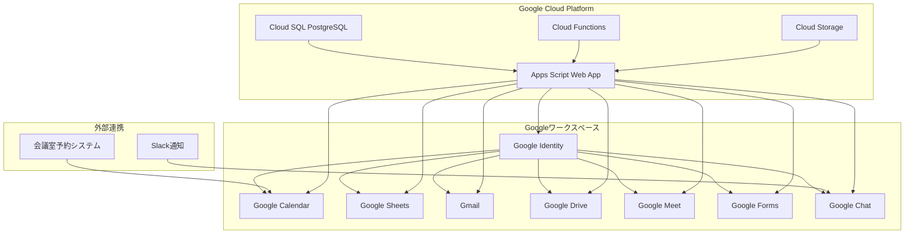
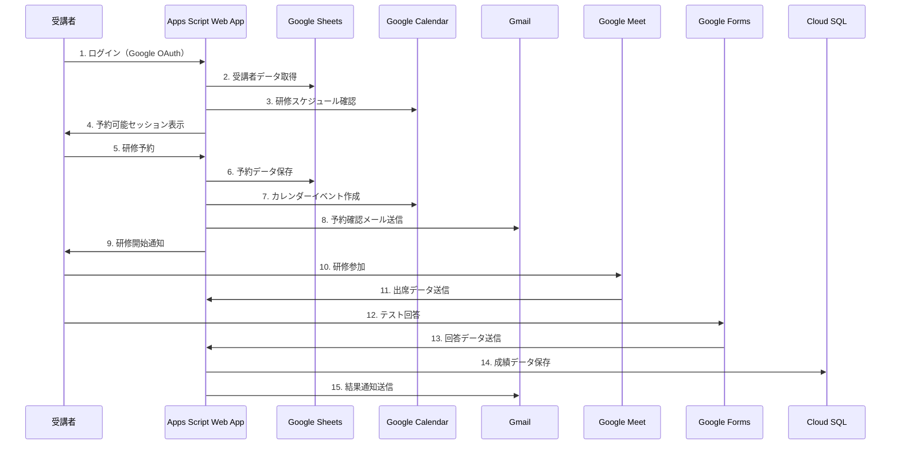

# Googleワークスペース制約下 LMSアーキテクチャ設計

## 1. 概要

Googleワークスペースの既存サービスを最大限活用し、追加コストを最小限に抑えた法務研修LMSシステムのアーキテクチャ設計。

## 2. Googleワークスペース活用戦略

### 2.1 既存サービス活用マトリックス

| 機能 | Googleサービス | 活用度 | 理由 |
|------|----------------|--------|------|
| 認証・認可 | Google Identity | ★★★★★ | 既存アカウントでシームレス |
| カレンダー管理 | Google Calendar | ★★★★★ | 会議室予約・スケジュール管理 |
| データ管理 | Google Sheets | ★★★★☆ | 受講者管理・進捗管理 |
| 通知 | Gmail + Chat | ★★★★☆ | 既存の通知インフラ活用 |
| ファイル共有 | Google Drive | ★★★★☆ | 資料配布・共有 |
| 会議 | Google Meet | ★★★★★ | 研修実施・録画 |
| フォーム | Google Forms | ★★★★☆ | テスト・アンケート |
| ドキュメント | Google Docs | ★★★☆☆ | 研修資料・レポート |

### 2.2 追加が必要なコンポーネント

| コンポーネント | 推奨技術 | 理由 |
|----------------|----------|------|
| データベース | Google Cloud SQL (PostgreSQL) | 既存インフラとの統合 |
| アプリケーション | Google Apps Script + Web App | コスト削減・管理簡素化 |
| 通知システム | Google Apps Script + Gmail API | 既存メールインフラ活用 |
| レポート | Google Data Studio | 無料で高度な可視化 |

## 3. システムアーキテクチャ

### 3.1 全体構成図



### 3.2 データフロー設計



## 4. Google Apps Script活用設計

### 4.1 メインWebアプリケーション

```javascript
// Code.gs - メインアプリケーション
function doGet(e) {
  const page = e.parameter.page || 'home';
  
  switch(page) {
    case 'home':
      return HtmlService.createTemplateFromFile('index')
        .evaluate()
        .setTitle('法務研修LMS')
        .setXFrameOptionsMode(HtmlService.XFrameOptionsMode.ALLOWALL);
    
    case 'reservation':
      return HtmlService.createTemplateFromFile('reservation')
        .evaluate()
        .setTitle('研修予約')
        .setXFrameOptionsMode(HtmlService.XFrameOptionsMode.ALLOWALL);
    
    case 'admin':
      return HtmlService.createTemplateFromFile('admin')
        .evaluate()
        .setTitle('管理画面')
        .setXFrameOptionsMode(HtmlService.XFrameOptionsMode.ALLOWALL);
    
    default:
      return HtmlService.createHtmlOutput('ページが見つかりません');
  }
}

// 予約処理
function makeReservation(participantId, sessionId) {
  try {
    const spreadsheet = SpreadsheetApp.openById(SPREADSHEET_ID);
    const reservationsSheet = spreadsheet.getSheetByName('Reservations');
    
    // 予約データを追加
    reservationsSheet.appendRow([
      new Date(),
      participantId,
      sessionId,
      'confirmed',
      Session.getActiveUser().getEmail()
    ]);
    
    // カレンダーイベント作成
    createCalendarEvent(sessionId, participantId);
    
    // 確認メール送信
    sendConfirmationEmail(participantId, sessionId);
    
    return { success: true, message: '予約が完了しました' };
  } catch (error) {
    console.error('予約エラー:', error);
    return { success: false, message: '予約に失敗しました: ' + error.message };
  }
}

// 予約変更処理
function changeReservation(participantId, oldSessionId, newSessionId, reason) {
  try {
    const spreadsheet = SpreadsheetApp.openById(SPREADSHEET_ID);
    const reservationsSheet = spreadsheet.getSheetByName('Reservations');
    
    // 変更条件チェック
    if (!canChangeReservation(participantId, oldSessionId, newSessionId)) {
      return { success: false, message: '変更条件を満たしていません' };
    }
    
    // 元の予約をキャンセル
    updateReservationStatus(participantId, oldSessionId, 'cancelled');
    
    // 新しい予約を作成
    reservationsSheet.appendRow([
      new Date(),
      participantId,
      newSessionId,
      'confirmed',
      Session.getActiveUser().getEmail(),
      reason
    ]);
    
    // カレンダー更新
    updateCalendarEvent(oldSessionId, newSessionId, participantId);
    
    return { success: true, message: '予約変更が完了しました' };
  } catch (error) {
    console.error('予約変更エラー:', error);
    return { success: false, message: '予約変更に失敗しました: ' + error.message };
  }
}
```

### 4.2 データ管理（Google Sheets）

```javascript
// DataManager.gs - データ管理クラス
class DataManager {
  constructor() {
    this.spreadsheet = SpreadsheetApp.openById(SPREADSHEET_ID);
  }
  
  // 受講者データ取得
  getParticipants() {
    const sheet = this.spreadsheet.getSheetByName('Participants');
    const data = sheet.getDataRange().getValues();
    const headers = data[0];
    
    return data.slice(1).map(row => {
      const participant = {};
      headers.forEach((header, index) => {
        participant[header] = row[index];
      });
      return participant;
    });
  }
  
  // 研修セッションデータ取得
  getSessions() {
    const sheet = this.spreadsheet.getSheetByName('Sessions');
    const data = sheet.getDataRange().getValues();
    const headers = data[0];
    
    return data.slice(1).map(row => {
      const session = {};
      headers.forEach((header, index) => {
        session[header] = row[index];
      });
      return session;
    });
  }
  
  // 予約データ保存
  saveReservation(reservationData) {
    const sheet = this.spreadsheet.getSheetByName('Reservations');
    sheet.appendRow([
      new Date(),
      reservationData.participantId,
      reservationData.sessionId,
      reservationData.status,
      Session.getActiveUser().getEmail(),
      reservationData.reason || ''
    ]);
  }
  
  // 出席データ保存
  saveAttendance(attendanceData) {
    const sheet = this.spreadsheet.getSheetByName('Attendance');
    sheet.appendRow([
      new Date(),
      attendanceData.participantId,
      attendanceData.sessionId,
      attendanceData.testScore,
      attendanceData.attendanceStatus
    ]);
  }
}
```

### 4.3 通知システム

```javascript
// NotificationManager.gs - 通知管理クラス
class NotificationManager {
  // 予約確認メール送信
  sendConfirmationEmail(participantId, sessionId) {
    const participant = getParticipantById(participantId);
    const session = getSessionById(sessionId);
    
    const subject = `【法務研修】予約確認 - ${session.name}`;
    const body = `
${participant.name} 様

法務研修の予約が完了いたしました。

【研修詳細】
- 研修名: ${session.name}
- 日時: ${session.scheduledDate} ${session.startTime} - ${session.endTime}
- 会議室: ${session.meetingRoom}
- 参加URL: ${session.meetingUrl}

研修開始30分前にリマインドメールをお送りします。

法務研修LMSシステム
    `;
    
    GmailApp.sendEmail(participant.email, subject, body);
  }
  
  // リマインドメール送信
  sendReminderEmail(participantId, sessionId) {
    const participant = getParticipantById(participantId);
    const session = getSessionById(sessionId);
    
    const subject = `【法務研修】リマインド - ${session.name}`;
    const body = `
${participant.name} 様

明日の法務研修のリマインドです。

【研修詳細】
- 研修名: ${session.name}
- 日時: ${session.scheduledDate} ${session.startTime} - ${session.endTime}
- 会議室: ${session.meetingRoom}
- 参加URL: ${session.meetingUrl}

お時間になりましたら、上記URLからご参加ください。

法務研修LMSシステム
    `;
    
    GmailApp.sendEmail(participant.email, subject, body);
  }
  
  // 結果通知メール送信
  sendResultEmail(participantId, sessionId, testScore) {
    const participant = getParticipantById(participantId);
    const session = getSessionById(sessionId);
    
    const subject = `【法務研修】結果通知 - ${session.name}`;
    const body = `
${participant.name} 様

法務研修の結果をお知らせします。

【研修結果】
- 研修名: ${session.name}
- 得点: ${testScore}点
- 合格基準: 80点以上
- 結果: ${testScore >= 80 ? '合格' : '不合格'}

${testScore < 80 ? '補講のご案内を別途お送りします。' : 'お疲れ様でした。'}

法務研修LMSシステム
    `;
    
    GmailApp.sendEmail(participant.email, subject, body);
  }
}
```

## 5. Google Cloud Platform連携

### 5.1 Cloud SQL設定

```sql
-- メインテーブル（Google Sheetsと同期）
CREATE TABLE participants (
    id UUID PRIMARY KEY,
    employee_id VARCHAR(50) UNIQUE,
    name VARCHAR(255) NOT NULL,
    email VARCHAR(255) NOT NULL,
    department VARCHAR(100),
    group_id INTEGER,
    status VARCHAR(50) DEFAULT 'active',
    created_at TIMESTAMP DEFAULT CURRENT_TIMESTAMP,
    updated_at TIMESTAMP DEFAULT CURRENT_TIMESTAMP
);

CREATE TABLE sessions (
    id UUID PRIMARY KEY,
    course_id UUID,
    session_name VARCHAR(255),
    scheduled_date DATE,
    start_time TIME,
    end_time TIME,
    meeting_room_id VARCHAR(100),
    google_calendar_event_id VARCHAR(255),
    max_participants INTEGER,
    current_participants INTEGER DEFAULT 0,
    status VARCHAR(50) DEFAULT 'scheduled',
    created_at TIMESTAMP DEFAULT CURRENT_TIMESTAMP,
    updated_at TIMESTAMP DEFAULT CURRENT_TIMESTAMP
);

CREATE TABLE reservations (
    id UUID PRIMARY KEY,
    participant_id UUID REFERENCES participants(id),
    session_id UUID REFERENCES sessions(id),
    status VARCHAR(50) DEFAULT 'confirmed',
    change_count INTEGER DEFAULT 0,
    last_changed_at TIMESTAMP,
    created_at TIMESTAMP DEFAULT CURRENT_TIMESTAMP,
    updated_at TIMESTAMP DEFAULT CURRENT_TIMESTAMP
);
```

### 5.2 Cloud Functions活用

```javascript
// 予約変更の自動処理
exports.handleReservationChange = async (req, res) => {
  const { participantId, oldSessionId, newSessionId, reason } = req.body;
  
  try {
    // 変更条件チェック
    const canChange = await checkChangeConditions(participantId, oldSessionId, newSessionId);
    if (!canChange.allowed) {
      return res.status(400).json({ error: canChange.reason });
    }
    
    // データベース更新
    await updateReservation(participantId, oldSessionId, newSessionId, reason);
    
    // カレンダー更新
    await updateGoogleCalendar(oldSessionId, newSessionId, participantId);
    
    // 通知送信
    await sendChangeNotification(participantId, newSessionId);
    
    res.json({ success: true, message: '予約変更が完了しました' });
  } catch (error) {
    console.error('予約変更エラー:', error);
    res.status(500).json({ error: '予約変更に失敗しました' });
  }
};

// リマインドの自動送信
exports.sendReminders = async (req, res) => {
  try {
    const tomorrow = new Date();
    tomorrow.setDate(tomorrow.getDate() + 1);
    
    const sessions = await getSessionsByDate(tomorrow);
    
    for (const session of sessions) {
      const participants = await getSessionParticipants(session.id);
      
      for (const participant of participants) {
        await sendReminderEmail(participant.email, session);
      }
    }
    
    res.json({ success: true, message: 'リマインド送信が完了しました' });
  } catch (error) {
    console.error('リマインド送信エラー:', error);
    res.status(500).json({ error: 'リマインド送信に失敗しました' });
  }
};
```

## 6. コスト最適化設計

### 6.1 コスト構造

| サービス | 月額コスト | 備考 |
|----------|------------|------|
| Google Workspace | 既存 | 追加コストなし |
| Google Apps Script | 無料 | 実行時間制限内 |
| Google Cloud SQL | $50-100 | 小規模インスタンス |
| Google Cloud Functions | $10-20 | 実行回数ベース |
| Google Cloud Storage | $5-10 | ファイル保存用 |
| **合計** | **$65-130** | **月額** |

### 6.2 無料枠活用

- **Google Apps Script**: 1日6時間の実行時間
- **Google Cloud Functions**: 月200万回の実行
- **Google Cloud SQL**: 小規模インスタンスの無料枠
- **Google Drive**: 15GBの無料ストレージ

### 6.3 スケーラビリティ考慮

```javascript
// 実行時間最適化
function optimizedDataProcessing() {
  const startTime = new Date().getTime();
  const maxExecutionTime = 5 * 60 * 1000; // 5分
  
  // バッチ処理で大量データを効率的に処理
  const batchSize = 100;
  let processedCount = 0;
  
  while (processedCount < totalRecords) {
    if (new Date().getTime() - startTime > maxExecutionTime) {
      // 実行時間制限に近づいたら次回実行に委ねる
      ScriptApp.newTrigger('continueProcessing')
        .timeBased()
        .after(1 * 60 * 1000) // 1分後
        .create();
      break;
    }
    
    processBatch(processedCount, batchSize);
    processedCount += batchSize;
  }
}
```

## 7. セキュリティ設計

### 7.1 認証・認可

```javascript
// 権限チェック
function checkUserPermission(userEmail, requiredRole) {
  const user = getUserByEmail(userEmail);
  const userRoles = getUserRoles(user.id);
  
  return userRoles.includes(requiredRole) || userRoles.includes('admin');
}

// データアクセス制御
function getAccessibleData(userEmail) {
  const user = getUserByEmail(userEmail);
  
  if (checkUserPermission(userEmail, 'admin')) {
    return getAllData();
  } else if (checkUserPermission(userEmail, 'manager')) {
    return getDepartmentData(user.department);
  } else {
    return getUserData(user.id);
  }
}
```

### 7.2 データ保護

```javascript
// 個人情報のマスキング
function maskPersonalData(data) {
  const maskedData = { ...data };
  
  if (maskedData.email) {
    const [local, domain] = maskedData.email.split('@');
    maskedData.email = local.substring(0, 2) + '***@' + domain;
  }
  
  if (maskedData.phone) {
    maskedData.phone = maskedData.phone.replace(/(\d{3})\d{4}(\d{4})/, '$1****$2');
  }
  
  return maskedData;
}
```

## 8. 監視・ログ設計

### 8.1 ログ管理

```javascript
// ログ記録
function logActivity(action, userId, details) {
  const logSheet = SpreadsheetApp.openById(LOG_SPREADSHEET_ID)
    .getSheetByName('ActivityLog');
  
  logSheet.appendRow([
    new Date(),
    action,
    userId,
    JSON.stringify(details),
    Session.getActiveUser().getEmail()
  ]);
}

// エラーログ
function logError(error, context) {
  const errorSheet = SpreadsheetApp.openById(LOG_SPREADSHEET_ID)
    .getSheetByName('ErrorLog');
  
  errorSheet.appendRow([
    new Date(),
    error.message,
    error.stack,
    JSON.stringify(context),
    Session.getActiveUser().getEmail()
  ]);
}
```

### 8.2 監視ダッシュボード

```javascript
// システム状況レポート
function generateSystemReport() {
  const report = {
    totalParticipants: getTotalParticipants(),
    activeReservations: getActiveReservations(),
    upcomingSessions: getUpcomingSessions(),
    systemHealth: checkSystemHealth(),
    lastUpdated: new Date()
  };
  
  // Google Data Studioに送信
  sendToDataStudio(report);
  
  return report;
}
```

## 9. 実装ロードマップ

### 9.1 Phase 1: 基盤構築（2週間）
- [ ] Google Apps Script Web App作成
- [ ] Google Sheetsデータ構造設計
- [ ] 基本認証機能実装
- [ ] 予約機能実装

### 9.2 Phase 2: 核心機能（3週間）
- [ ] 予約変更機能実装
- [ ] Google Calendar連携
- [ ] 通知システム実装
- [ ] テスト機能実装

### 9.3 Phase 3: 高度機能（2週間）
- [ ] 管理ダッシュボード作成
- [ ] レポート機能実装
- [ ] 監視・ログ機能実装
- [ ] パフォーマンス最適化

### 9.4 Phase 4: 運用開始（1週間）
- [ ] テスト・デバッグ
- [ ] ユーザートレーニング
- [ ] 本番環境デプロイ
- [ ] 運用開始

## 10. 運用・保守

### 10.1 日常運用
- **データバックアップ**: 日次でGoogle Driveに自動バックアップ
- **ログ監視**: 週次でエラーログ確認
- **パフォーマンス監視**: 月次でシステム性能確認

### 10.2 障害対応
- **自動復旧**: 一般的なエラーは自動復旧機能で対応
- **手動対応**: 重大な障害は管理者が手動対応
- **連絡体制**: Slack通知で即座に管理者に連絡

### 10.3 アップデート
- **機能追加**: 月次で新機能を追加
- **バグ修正**: 発見次第即座に修正
- **セキュリティ更新**: 四半期ごとにセキュリティ更新

---

**作成日**: 2024年10月17日  
**バージョン**: 1.0  
**対象**: Googleワークスペース制約下でのLMSシステム  
**予算**: 月額$65-130（既存Google Workspace利用）
