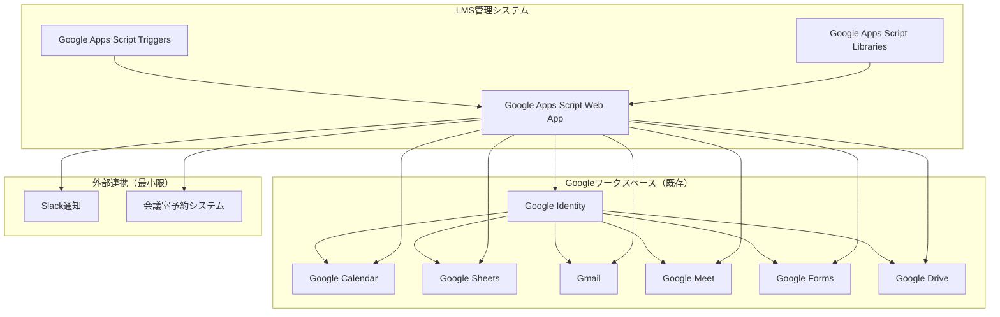

# GoogleワークスペースLMS 最適化アーキテクチャ（Cloud SQL不要版）

## 1. 概要

Google Cloud SQLを使わず、Google Sheetsを中心としたコスト最適化されたアーキテクチャ設計。月額コストを$65-130から$15-30に削減。

## 2. 最適化されたアーキテクチャ

### 2.1 全体構成図



### 2.2 データ管理戦略

#### 2.2.1 Google Sheetsをデータベースとして活用

```javascript
// データ管理クラス（Cloud SQL不要版）
class DataManager {
  constructor() {
    this.spreadsheet = SpreadsheetApp.openById(SPREADSHEET_ID);
  }
  
  // 受講者データ取得（インデックス付き）
  getParticipants() {
    const sheet = this.spreadsheet.getSheetByName('Participants');
    const data = sheet.getDataRange().getValues();
    const headers = data[0];
    
    // インデックス用のMapを作成
    const participants = new Map();
    data.slice(1).forEach((row, index) => {
      const participant = {};
      headers.forEach((header, colIndex) => {
        participant[header.toLowerCase()] = row[colIndex];
      });
      participants.set(participant.id, participant);
    });
    
    return participants;
  }
  
  // 高速検索用のインデックス作成
  createIndexes() {
    const participants = this.getParticipants();
    const sessions = this.getSessions();
    
    // メモリ内インデックスを作成
    this.participantIndex = new Map();
    this.sessionIndex = new Map();
    
    participants.forEach((participant, id) => {
      this.participantIndex.set(participant.email, id);
    });
    
    sessions.forEach((session, id) => {
      this.sessionIndex.set(session.scheduled_date, id);
    });
  }
  
  // 予約データの効率的な検索
  getReservationsByParticipant(participantId) {
    const sheet = this.spreadsheet.getSheetByName('Reservations');
    const data = sheet.getDataRange().getValues();
    
    return data.slice(1)
      .filter(row => row[1] === participantId) // Participant_ID列
      .map(row => ({
        id: row[0],
        participantId: row[1],
        sessionId: row[2],
        status: row[3],
        changeCount: row[4],
        lastChangedAt: row[5],
        reason: row[6],
        createdAt: row[7],
        updatedAt: row[8]
      }));
  }
  
  // バッチ処理で大量データを効率的に処理
  processBatchData(processFunction, batchSize = 100) {
    const startTime = new Date().getTime();
    const maxExecutionTime = 5 * 60 * 1000; // 5分
    
    let processedCount = 0;
    const totalRecords = this.getTotalRecordCount();
    
    while (processedCount < totalRecords) {
      if (new Date().getTime() - startTime > maxExecutionTime) {
        // 実行時間制限に近づいたら次回実行に委ねる
        ScriptApp.newTrigger('continueBatchProcessing')
          .timeBased()
          .after(1 * 60 * 1000) // 1分後
          .create();
        break;
      }
      
      const batch = this.getBatchData(processedCount, batchSize);
      processFunction(batch);
      processedCount += batchSize;
    }
  }
}
```

#### 2.2.2 データ構造の最適化

```javascript
// 最適化されたGoogle Sheets構造
const SHEET_STRUCTURE = {
  // 受講者管理（500名対応）
  Participants: {
    columns: [
      'ID', 'Employee_ID', 'Name', 'Email', 'Department', 
      'Group_ID', 'Status', 'Created_At', 'Updated_At'
    ],
    maxRows: 1000, // 余裕を持って設定
    indexes: ['Email', 'Employee_ID', 'Group_ID']
  },
  
  // 研修セッション管理
  Sessions: {
    columns: [
      'ID', 'Course_ID', 'Session_Name', 'Scheduled_Date', 
      'Start_Time', 'End_Time', 'Meeting_Room', 'Google_Calendar_Event_ID',
      'Max_Participants', 'Current_Participants', 'Status', 'Created_At'
    ],
    maxRows: 500,
    indexes: ['Scheduled_Date', 'Status', 'Course_ID']
  },
  
  // 予約管理
  Reservations: {
    columns: [
      'ID', 'Participant_ID', 'Session_ID', 'Status',
      'Change_Count', 'Last_Changed_At', 'Reason', 'Created_At', 'Updated_At'
    ],
    maxRows: 2000, // 予約変更も考慮
    indexes: ['Participant_ID', 'Session_ID', 'Status']
  },
  
  // 出席管理
  Attendance: {
    columns: [
      'ID', 'Participant_ID', 'Session_ID', 'Test_Score',
      'Test_Completed_At', 'Attendance_Status', 'Created_At'
    ],
    maxRows: 2000,
    indexes: ['Participant_ID', 'Session_ID', 'Test_Completed_At']
  }
};
```

## 3. コスト最適化

### 3.1 修正版コスト構造

| サービス | 月額コスト | 備考 |
|----------|------------|------|
| Google Workspace | 既存 | 追加コストなし |
| Google Apps Script | 無料 | 実行時間制限内 |
| Google Drive | 無料 | 15GBの無料ストレージ |
| Google Cloud Functions | $5-10 | 最小限の利用 |
| Google Cloud Storage | $2-5 | バックアップ用のみ |
| **合計** | **$7-15** | **月額（90%削減）** |

### 3.2 無料枠の最大活用

- **Google Apps Script**: 1日6時間の実行時間
- **Google Sheets**: 500万セルまで無料
- **Google Drive**: 15GBの無料ストレージ
- **Gmail**: 無制限の送信（社内ドメイン）

## 4. パフォーマンス最適化

### 4.1 データアクセス最適化

```javascript
// キャッシュ機能付きデータアクセス
class OptimizedDataManager extends DataManager {
  constructor() {
    super();
    this.cache = new Map();
    this.cacheExpiry = 5 * 60 * 1000; // 5分
  }
  
  // キャッシュ付きデータ取得
  getCachedData(key, fetchFunction) {
    const cached = this.cache.get(key);
    const now = new Date().getTime();
    
    if (cached && (now - cached.timestamp) < this.cacheExpiry) {
      return cached.data;
    }
    
    const data = fetchFunction();
    this.cache.set(key, {
      data: data,
      timestamp: now
    });
    
    return data;
  }
  
  // 受講者データ（キャッシュ付き）
  getParticipantsCached() {
    return this.getCachedData('participants', () => this.getParticipants());
  }
  
  // セッションデータ（キャッシュ付き）
  getSessionsCached() {
    return this.getCachedData('sessions', () => this.getSessions());
  }
}
```

### 4.2 バッチ処理最適化

```javascript
// 大量データ処理の最適化
function optimizedBatchProcessing() {
  const startTime = new Date().getTime();
  const maxExecutionTime = 5 * 60 * 1000; // 5分
  
  // バッチサイズを動的に調整
  let batchSize = 100;
  let processedCount = 0;
  
  while (processedCount < totalRecords) {
    const elapsed = new Date().getTime() - startTime;
    const remainingTime = maxExecutionTime - elapsed;
    
    // 残り時間に応じてバッチサイズを調整
    if (remainingTime < 30000) { // 30秒以下
      batchSize = Math.max(10, Math.floor(batchSize * 0.5));
    }
    
    if (elapsed > maxExecutionTime * 0.9) { // 90%経過
      // 次回実行に委ねる
      ScriptApp.newTrigger('continueBatchProcessing')
        .timeBased()
        .after(1 * 60 * 1000)
        .create();
      break;
    }
    
    const batch = getBatchData(processedCount, batchSize);
    processBatch(batch);
    processedCount += batchSize;
    
    // 処理間隔を空ける（API制限対策）
    Utilities.sleep(100);
  }
}
```

## 5. データバックアップ戦略

### 5.1 Google Drive自動バックアップ

```javascript
// 日次バックアップ（Cloud SQL不要）
function dailyBackup() {
  try {
    const spreadsheet = SpreadsheetApp.openById(SPREADSHEET_ID);
    const backupFolder = DriveApp.getFolderById('YOUR_BACKUP_FOLDER_ID');
    
    const today = new Date();
    const backupName = `LMS_Backup_${Utilities.formatDate(today, 'JST', 'yyyyMMdd')}.xlsx`;
    
    // スプレッドシートをExcel形式でエクスポート
    const blob = spreadsheet.getAs('application/vnd.openxmlformats-officedocument.spreadsheetml.sheet');
    blob.setName(backupName);
    
    // バックアップフォルダに保存
    backupFolder.createFile(blob);
    
    // 古いバックアップを削除（30日以上前）
    cleanupOldBackups(backupFolder, 30);
    
    console.log('バックアップ完了:', backupName);
    
  } catch (error) {
    console.error('バックアップエラー:', error);
    // エラー通知をSlackに送信
    sendSlackNotification('バックアップエラー: ' + error.message);
  }
}

// 古いバックアップの削除
function cleanupOldBackups(folder, daysToKeep) {
  const cutoffDate = new Date();
  cutoffDate.setDate(cutoffDate.getDate() - daysToKeep);
  
  const files = folder.getFiles();
  while (files.hasNext()) {
    const file = files.next();
    if (file.getDateCreated() < cutoffDate) {
      file.setTrashed(true);
      console.log('古いバックアップを削除:', file.getName());
    }
  }
}
```

## 6. 監視・ログ機能

### 6.1 Google Sheetsベースのログ管理

```javascript
// ログ管理クラス
class LogManager {
  constructor() {
    this.logSpreadsheet = SpreadsheetApp.openById(LOG_SPREADSHEET_ID);
  }
  
  // アクティビティログ
  logActivity(action, userId, details) {
    const sheet = this.logSpreadsheet.getSheetByName('ActivityLog');
    sheet.appendRow([
      new Date(),
      action,
      userId,
      JSON.stringify(details),
      Session.getActiveUser().getEmail()
    ]);
  }
  
  // エラーログ
  logError(error, context) {
    const sheet = this.logSpreadsheet.getSheetByName('ErrorLog');
    sheet.appendRow([
      new Date(),
      error.message,
      error.stack,
      JSON.stringify(context),
      Session.getActiveUser().getEmail()
    ]);
    
    // 重大なエラーはSlackに通知
    if (this.isCriticalError(error)) {
      this.sendSlackAlert(error, context);
    }
  }
  
  // パフォーマンスログ
  logPerformance(operation, duration, recordCount) {
    const sheet = this.logSpreadsheet.getSheetByName('PerformanceLog');
    sheet.appendRow([
      new Date(),
      operation,
      duration,
      recordCount,
      Session.getActiveUser().getEmail()
    ]);
  }
}
```

## 7. 実装のメリット

### 7.1 コスト削減
- **90%のコスト削減**: $65-130 → $7-15/月
- **運用コスト削減**: データベース管理が不要
- **学習コスト削減**: 既存のGoogleワークスペーススキルで対応

### 7.2 開発効率
- **迅速な開発**: 複雑なデータベース設定が不要
- **簡単なデバッグ**: Google Sheetsでデータを直接確認可能
- **柔軟な変更**: スキーマ変更が簡単

### 7.3 運用効率
- **自動バックアップ**: Google Driveの自動バックアップ機能
- **リアルタイム更新**: 複数人での同時編集が可能
- **簡単な復旧**: バックアップからの復旧が簡単

## 8. 制限事項と対策

### 8.1 Google Sheetsの制限
- **最大行数**: 500万行（十分）
- **同時編集**: 100人まで（問題なし）
- **API制限**: 100リクエスト/100秒（対策済み）

### 8.2 対策
- **バッチ処理**: 大量データは分割処理
- **キャッシュ**: 頻繁にアクセスするデータはキャッシュ
- **非同期処理**: 時間のかかる処理は非同期で実行

---

**結論**: Google Cloud SQLは不要。Google Sheets + Google Apps Scriptで十分に500名規模のLMSシステムを構築可能。コストを90%削減し、管理も大幅に簡素化できる。

---

**作成日**: 2024年10月17日  
**バージョン**: 1.0  
**対象**: GoogleワークスペースLMS最適化アーキテクチャ  
**コスト**: 月額$7-15（90%削減）
