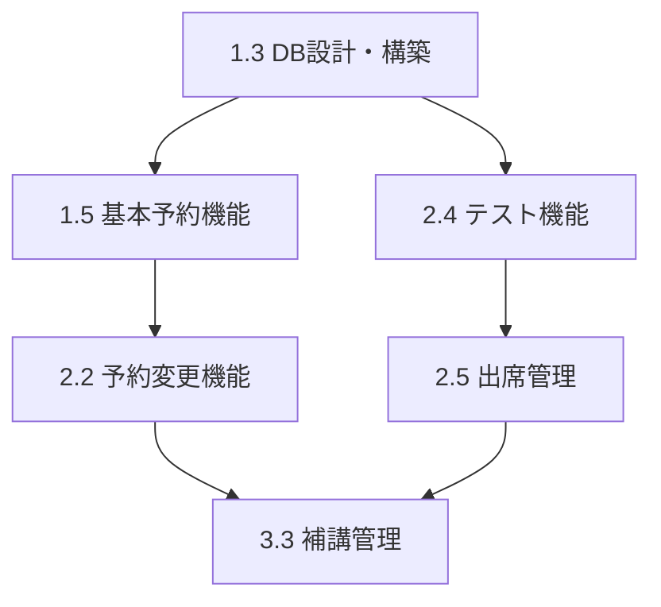

# 法務研修LMS - WBS（作業分解構造）

**プロジェクト名:** 法務研修LMS  
**プログラム:** 法務部門  
**作成日:** 2025-10-16  
**最終更新:** 2025-10-16  
**プロジェクト期間:** 2025-10-16 ~ 2025-12-11  
**リリース目標:** 2025-11-01

---

## WBS概要

法務研修LMSの開発を4つのフェーズに分け、各フェーズの作業を詳細に分解した作業分解構造（WBS）。

---

## 📅 プロジェクトマイルストーン

| フェーズ | 期間 | 期限 | ステータス |
|---------|------|------|----------|
| Phase 1: 基盤構築 | 2週間 | 2025-10-30 | 🔵 進行中 |
| Phase 2: コア機能実装 | 3週間 | 2025-11-20 | ⚪ 未着手 |
| Phase 3: 管理機能・最適化 | 2週間 | 2025-12-04 | ⚪ 未着手 |
| Phase 4: テスト・運用開始 | 1週間 | 2025-12-11 | ⚪ 未着手 |

---

## Phase 1: 基盤構築（2025-10-16 ~ 2025-10-30）

### 1.1 プロジェクト立ち上げ
- [x] 1.1.1 プロジェクト初期化
  - [x] 1.1.1.1 プロジェクト構造作成
  - [x] 1.1.1.2 プロジェクト憲章作成
  - [x] 1.1.1.3 PRD作成
  - [x] 1.1.1.4 既存設計書の整理
- [ ] 1.1.2 ステークホルダー管理
  - [ ] 1.1.2.1 ステークホルダー分析
  - [ ] 1.1.2.2 コミュニケーション計画策定
  - [ ] 1.1.2.3 キックオフミーティング実施

### 1.2 技術環境構築
- [ ] 1.2.1 Google Apps Script環境構築
  - [ ] 1.2.1.1 Apps Scriptプロジェクト作成
  - [ ] 1.2.1.2 開発環境セットアップ
  - [ ] 1.2.1.3 バージョン管理設定（Git連携）
- [ ] 1.2.2 Google Cloud環境構築
  - [ ] 1.2.2.1 GCPプロジェクト作成
  - [ ] 1.2.2.2 Cloud SQL (PostgreSQL)インスタンス作成
  - [ ] 1.2.2.3 Cloud Functions環境設定
  - [ ] 1.2.2.4 認証・権限設定
- [ ] 1.2.3 Google Sheets構築
  - [ ] 1.2.3.1 マスターシート設計
  - [ ] 1.2.3.2 設定管理シート作成
  - [ ] 1.2.3.3 データ構造定義

### 1.3 データベース設計・構築
- [ ] 1.3.1 データモデル設計
  - [ ] 1.3.1.1 ER図作成
  - [ ] 1.3.1.2 テーブル定義書作成
  - [ ] 1.3.1.3 インデックス設計
- [ ] 1.3.2 データベース構築
  - [ ] 1.3.2.1 テーブル作成（courses, participants, sessions, reservations, attendance）
  - [ ] 1.3.2.2 初期データ投入
  - [ ] 1.3.2.3 バックアップ設定

### 1.4 Web App骨格作成
- [ ] 1.4.1 フロントエンド基盤
  - [ ] 1.4.1.1 HTML/CSS/JSテンプレート作成
  - [ ] 1.4.1.2 レスポンシブデザイン実装
  - [ ] 1.4.1.3 共通コンポーネント作成（ヘッダー、フッター、ナビゲーション）
- [ ] 1.4.2 バックエンド基盤
  - [ ] 1.4.2.1 Apps Scriptメインコード骨格作成
  - [ ] 1.4.2.2 ルーティング機能実装
  - [ ] 1.4.2.3 エラーハンドリング基盤
- [ ] 1.4.3 認証機能
  - [ ] 1.4.3.1 Google OAuth 2.0実装
  - [ ] 1.4.3.2 ロール管理（管理者/受講者）
  - [ ] 1.4.3.3 セッション管理

### 1.5 基本予約機能実装
- [ ] 1.5.1 予約画面
  - [ ] 1.5.1.1 研修コース一覧表示
  - [ ] 1.5.1.2 セッション選択UI
  - [ ] 1.5.1.3 予約フォーム作成
- [ ] 1.5.2 予約処理
  - [ ] 1.5.2.1 予約登録ロジック実装
  - [ ] 1.5.2.2 定員管理機能
  - [ ] 1.5.2.3 重複チェック機能
- [ ] 1.5.3 確認画面
  - [ ] 1.5.3.1 予約確認画面実装
  - [ ] 1.5.3.2 マイページ（予約一覧）実装

---

## Phase 2: コア機能実装（2025-10-31 ~ 2025-11-20）

### 2.1 Google Calendar連携
- [ ] 2.1.1 Calendar API統合
  - [ ] 2.1.1.1 Calendar API認証設定
  - [ ] 2.1.1.2 イベント作成機能実装
  - [ ] 2.1.1.3 イベント更新/削除機能実装
- [ ] 2.1.2 自動連携機能
  - [ ] 2.1.2.1 予約時の自動カレンダー登録
  - [ ] 2.1.2.2 予約変更時のカレンダー同期
  - [ ] 2.1.2.3 キャンセル時のイベント削除
- [ ] 2.1.3 会議室管理
  - [ ] 2.1.3.1 会議室リソース管理
  - [ ] 2.1.3.2 会議室予約連携
  - [ ] 2.1.3.3 空き状況確認機能

### 2.2 予約変更機能実装
- [ ] 2.2.1 変更条件管理
  - [ ] 2.2.1.1 変更期限チェック（3日前まで）
  - [ ] 2.2.1.2 変更回数制限（1回まで）
  - [ ] 2.2.1.3 同一グループ内変更チェック
- [ ] 2.2.2 変更画面
  - [ ] 2.2.2.1 予約変更申請画面
  - [ ] 2.2.2.2 変更可能セッション表示
  - [ ] 2.2.2.3 変更確認画面
- [ ] 2.2.3 変更処理
  - [ ] 2.2.3.1 元の予約キャンセル処理
  - [ ] 2.2.3.2 新しい予約作成処理
  - [ ] 2.2.3.3 待機リスト更新処理

### 2.3 通知システム実装
- [ ] 2.3.1 メール送信基盤
  - [ ] 2.3.1.1 Gmail API統合
  - [ ] 2.3.1.2 メールテンプレート作成
  - [ ] 2.3.1.3 送信制限対応（1,500通/日）
- [ ] 2.3.2 予約確認メール
  - [ ] 2.3.2.1 予約完了メール自動送信
  - [ ] 2.3.2.2 カレンダーファイル添付
  - [ ] 2.3.2.3 送信履歴記録
- [ ] 2.3.3 リマインド機能
  - [ ] 2.3.3.1 3日前リマインド設定
  - [ ] 2.3.3.2 1日前リマインド設定
  - [ ] 2.3.3.3 トリガー設定（時間ベース）
- [ ] 2.3.4 結果通知
  - [ ] 2.3.4.1 テスト結果メール
  - [ ] 2.3.4.2 合格/不合格通知
  - [ ] 2.3.4.3 補講案内メール

### 2.4 テスト機能実装
- [ ] 2.4.1 テスト管理
  - [ ] 2.4.1.1 テスト問題登録機能
  - [ ] 2.4.1.2 テスト設定管理（合格点、制限時間）
  - [ ] 2.4.1.3 テストバージョン管理
- [ ] 2.4.2 テスト受験画面
  - [ ] 2.4.2.1 オンラインテスト画面実装
  - [ ] 2.4.2.2 回答入力UI（選択式/記述式）
  - [ ] 2.4.2.3 タイマー機能
  - [ ] 2.4.2.4 一時保存機能
- [ ] 2.4.3 自動採点機能
  - [ ] 2.4.3.1 選択式問題の自動採点
  - [ ] 2.4.3.2 合格/不合格判定
  - [ ] 2.4.3.3 採点結果記録
- [ ] 2.4.4 手動採点機能
  - [ ] 2.4.4.1 記述式問題の採点画面
  - [ ] 2.4.4.2 採点ワークフロー
  - [ ] 2.4.4.3 フィードバック機能

### 2.5 出席管理機能
- [ ] 2.5.1 出席確認
  - [ ] 2.5.1.1 テスト回答による自動出席登録
  - [ ] 2.5.1.2 遅刻・早退管理
  - [ ] 2.5.1.3 欠席処理
- [ ] 2.5.2 出席状況管理
  - [ ] 2.5.2.1 出席率計算
  - [ ] 2.5.2.2 グループ別出席状況
  - [ ] 2.5.2.3 個人別出席履歴

---

## Phase 3: 管理機能・最適化（2025-11-21 ~ 2025-12-04）

### 3.1 管理ダッシュボード実装
- [ ] 3.1.1 全体ダッシュボード
  - [ ] 3.1.1.1 全体進捗表示
  - [ ] 3.1.1.2 グループ別進捗表示
  - [ ] 3.1.1.3 リアルタイム更新機能
- [ ] 3.1.2 受講者管理画面
  - [ ] 3.1.2.1 受講者一覧表示
  - [ ] 3.1.2.2 グループ振り分け機能
  - [ ] 3.1.2.3 受講者詳細表示
- [ ] 3.1.3 研修管理画面
  - [ ] 3.1.3.1 研修コース管理
  - [ ] 3.1.3.2 セッション管理
  - [ ] 3.1.3.3 スケジュール調整

### 3.2 レポート機能実装
- [ ] 3.2.1 出席率レポート
  - [ ] 3.2.1.1 全体出席率集計
  - [ ] 3.2.1.2 グループ別出席率
  - [ ] 3.2.1.3 個人別出席履歴
- [ ] 3.2.2 成績レポート
  - [ ] 3.2.2.1 合格率集計
  - [ ] 3.2.2.2 平均点計算
  - [ ] 3.2.2.3 不合格者リスト
- [ ] 3.2.3 レポート出力
  - [ ] 3.2.3.1 CSV出力機能
  - [ ] 3.2.3.2 PDF出力機能
  - [ ] 3.2.3.3 自動レポート送信（週次/月次）

### 3.3 補講管理機能
- [ ] 3.3.1 補講対象者抽出
  - [ ] 3.3.1.1 未受講者の自動抽出
  - [ ] 3.3.1.2 不合格者の自動抽出
  - [ ] 3.3.1.3 補講リスト作成
- [ ] 3.3.2 補講スケジュール管理
  - [ ] 3.3.2.1 補講セッション作成
  - [ ] 3.3.2.2 補講予約機能
  - [ ] 3.3.2.3 補講案内送信
- [ ] 3.3.3 再テスト機能
  - [ ] 3.3.3.1 再テスト設定
  - [ ] 3.3.3.2 再受験管理
  - [ ] 3.3.3.3 再テスト結果記録

### 3.4 パフォーマンス最適化
- [ ] 3.4.1 データベース最適化
  - [ ] 3.4.1.1 インデックス最適化
  - [ ] 3.4.1.2 クエリチューニング
  - [ ] 3.4.1.3 データ圧縮設定
- [ ] 3.4.2 処理速度改善
  - [ ] 3.4.2.1 キャッシュ実装
  - [ ] 3.4.2.2 非同期処理実装
  - [ ] 3.4.2.3 バッチ処理最適化
- [ ] 3.4.3 スケーラビリティ対応
  - [ ] 3.4.3.1 500名同時アクセス対応
  - [ ] 3.4.3.2 負荷分散設定
  - [ ] 3.4.3.3 リソース監視設定

### 3.5 エラーハンドリング・ログ
- [ ] 3.5.1 エラーハンドリング強化
  - [ ] 3.5.1.1 エラー分類とメッセージ定義
  - [ ] 3.5.1.2 ユーザーフレンドリーなエラー表示
  - [ ] 3.5.1.3 エラー復旧処理
- [ ] 3.5.2 ログ機能
  - [ ] 3.5.2.1 アクセスログ記録
  - [ ] 3.5.2.2 エラーログ記録
  - [ ] 3.5.2.3 操作履歴記録
- [ ] 3.5.3 監視機能
  - [ ] 3.5.3.1 システム監視設定
  - [ ] 3.5.3.2 アラート設定
  - [ ] 3.5.3.3 パフォーマンス監視

---

## Phase 4: テスト・運用開始（2025-12-05 ~ 2025-12-11）

### 4.1 テスト実施
- [ ] 4.1.1 単体テスト
  - [ ] 4.1.1.1 全機能の単体テスト実施
  - [ ] 4.1.1.2 バグ修正
  - [ ] 4.1.1.3 テスト結果ドキュメント作成
- [ ] 4.1.2 統合テスト
  - [ ] 4.1.2.1 機能間連携テスト
  - [ ] 4.1.2.2 データ整合性テスト
  - [ ] 4.1.2.3 エラーケーステスト
- [ ] 4.1.3 パフォーマンステスト
  - [ ] 4.1.3.1 負荷テスト（100名同時アクセス）
  - [ ] 4.1.3.2 ストレステスト（500名想定）
  - [ ] 4.1.3.3 応答時間測定
- [ ] 4.1.4 セキュリティテスト
  - [ ] 4.1.4.1 認証・認可テスト
  - [ ] 4.1.4.2 データ暗号化確認
  - [ ] 4.1.4.3 脆弱性スキャン

### 4.2 ユーザー受入テスト（UAT）
- [ ] 4.2.1 ベータ版テスト
  - [ ] 4.2.1.1 法務部門管理者によるテスト
  - [ ] 4.2.1.2 フィードバック収集
  - [ ] 4.2.1.3 改善実施
- [ ] 4.2.2 実データテスト
  - [ ] 4.2.2.1 実際の受講者データ投入
  - [ ] 4.2.2.2 運用フロー確認
  - [ ] 4.2.2.3 最終調整

### 4.3 ドキュメント作成
- [ ] 4.3.1 運用マニュアル
  - [ ] 4.3.1.1 管理者マニュアル作成
  - [ ] 4.3.1.2 運用手順書作成
  - [ ] 4.3.1.3 トラブルシューティングガイド
- [ ] 4.3.2 ユーザーマニュアル
  - [ ] 4.3.2.1 受講者向けマニュアル作成
  - [ ] 4.3.2.2 FAQ作成
  - [ ] 4.3.2.3 チュートリアル動画作成（オプション）
- [ ] 4.3.3 技術ドキュメント
  - [ ] 4.3.3.1 システム設計書更新
  - [ ] 4.3.3.2 API仕様書作成
  - [ ] 4.3.3.3 保守・拡張ガイド

### 4.4 ユーザートレーニング
- [ ] 4.4.1 管理者トレーニング
  - [ ] 4.4.1.1 トレーニング資料作成
  - [ ] 4.4.1.2 トレーニング実施（法務部門2-3名）
  - [ ] 4.4.1.3 Q&A対応
- [ ] 4.4.2 受講者向け説明
  - [ ] 4.4.2.1 利用ガイド配布
  - [ ] 4.4.2.2 説明会実施（オプション）
  - [ ] 4.4.2.3 問い合わせ窓口設置

### 4.5 本番環境デプロイ
- [ ] 4.5.1 デプロイ準備
  - [ ] 4.5.1.1 本番環境最終確認
  - [ ] 4.5.1.2 データバックアップ
  - [ ] 4.5.1.3 ロールバックプラン作成
- [ ] 4.5.2 デプロイ実施
  - [ ] 4.5.2.1 本番環境へのデプロイ
  - [ ] 4.5.2.2 動作確認
  - [ ] 4.5.2.3 監視開始
- [ ] 4.5.3 運用開始
  - [ ] 4.5.3.1 受講者への利用案内送信
  - [ ] 4.5.3.2 運用監視体制開始
  - [ ] 4.5.3.3 サポート体制確立

---

## 🚨 リスク管理

### 高リスクタスク（遅延すると全体に影響）

| タスクID | タスク名 | リスク内容 | 軽減策 |
|---------|---------|----------|--------|
| 1.3.2 | データベース構築 | スキーマ設計ミス | 早期レビュー実施 |
| 2.1.1 | Calendar API統合 | API制限・エラー | 事前検証・代替案準備 |
| 2.4.3 | 自動採点機能 | 複雑なロジック | 十分なテスト時間確保 |
| 3.4.3 | 500名同時アクセス対応 | パフォーマンス問題 | 早期負荷テスト実施 |

### 依存関係のあるタスク



---

## 📊 進捗管理ルール

### 日次管理
- [ ] 毎日朝：本日のタスク確認・優先順位付け
- [ ] 毎日夕：完了タスクのチェックオフ、ブロッカー報告

### 週次管理
- [ ] 毎週水曜日：進捗会議（15:00-15:30）
- [ ] 毎週金曜日：週次レビューと翌週計画

### フェーズ管理
- [ ] フェーズ完了時：成果物レビュー、次フェーズキックオフ

---

## 📈 進捗可視化

### Phase 1進捗（2025-10-30まで）
```
進捗: ██████░░░░░░░░░░ 30% (5/17タスク完了)
```

### Phase 2進捗（2025-11-20まで）
```
進捗: ░░░░░░░░░░░░░░░░ 0% (0/25タスク完了)
```

### Phase 3進捗（2025-12-04まで）
```
進捗: ░░░░░░░░░░░░░░░░ 0% (0/15タスク完了)
```

### Phase 4進捗（2025-12-11まで）
```
進捗: ░░░░░░░░░░░░░░░░ 0% (0/13タスク完了)
```

---

## 関連ドキュメント

- [プロジェクト憲章](../1_initiating/project_charter.md)
- [プロダクト要求仕様書（PRD）](product_requirements_document.md)
- [システム設計書](法務研修LMSシステム設計書.md)
- [リスク管理計画](risk_management_plan.md)

---

**作成者**: プロダクト企画チーム  
**承認者**: 法務部門責任者  
**最終更新日**: 2025-10-16

