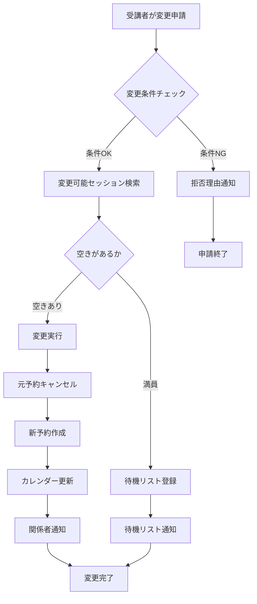
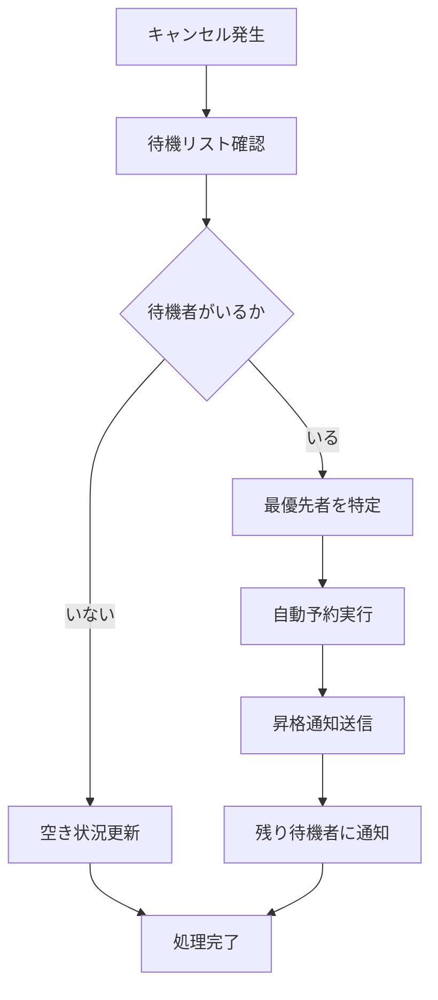

# 予約変更機能 対策設計書

## 1. 概要

法務研修LMSシステムにおける予約変更機能の詳細な対策設計。500名規模の受講者を3グループに分けて並行運営する中で、予約変更による混乱を最小限に抑えるための仕組みを定義する。

## 2. 予約変更の制約条件

### 2.1 変更可能期間
- **変更締切**: 研修開始の3日前まで
- **理由**: 会議室確保、資料準備、講師調整のため
- **例外**: 緊急事由（病気、家族の急用等）は管理者判断

### 2.2 変更回数制限
- **基本ルール**: 1回まで
- **理由**: システム負荷軽減、管理の複雑化防止
- **例外**: システム側の不具合による変更は回数にカウントしない

### 2.3 変更可能範囲
- **グループ内変更**: 同じグループ内でのみ変更可能
- **理由**: 研修内容・レベルがグループごとに異なるため
- **例外**: 管理者の特別承認があればグループ間変更も可能

### 2.4 定員制約
- **変更先の定員**: 変更先セッションに空きがある場合のみ
- **待機リスト**: 定員満杯の場合は待機リストに登録
- **優先順位**: 先着順、ただし緊急事由は優先

## 3. 予約変更プロセスの詳細設計

### 3.1 変更申請フロー



### 3.2 システム側の自動チェック項目

#### 3.2.1 基本条件チェック
- [ ] 変更申請日が研修開始3日前以内か
- [ ] 過去の変更回数が1回未満か
- [ ] 変更先が同じグループ内か
- [ ] 変更先セッションが存在するか

#### 3.2.2 定員・スケジュールチェック
- [ ] 変更先セッションに空きがあるか
- [ ] 変更先の時間が受講者の他の予定と重複しないか
- [ ] 会議室が利用可能か
- [ ] 講師が対応可能か

#### 3.2.3 ビジネスルールチェック
- [ ] 研修内容の前提条件を満たしているか
- [ ] 受講者の権限レベルが適切か
- [ ] 部門・役職による制約はないか

### 3.3 変更実行時の処理

#### 3.3.1 データベース更新
```sql
-- 1. 元の予約をキャンセル状態に更新
UPDATE reservations 
SET status = 'cancelled', 
    updated_at = NOW()
WHERE id = :original_reservation_id;

-- 2. 新しい予約を作成
INSERT INTO reservations (
    participant_id, 
    session_id, 
    status, 
    original_session_id,
    change_reason,
    created_at
) VALUES (
    :participant_id,
    :new_session_id,
    'confirmed',
    :original_session_id,
    :change_reason,
    NOW()
);

-- 3. 変更履歴を記録
INSERT INTO reservation_changes (
    reservation_id,
    old_session_id,
    new_session_id,
    change_reason,
    changed_at
) VALUES (
    :new_reservation_id,
    :original_session_id,
    :new_session_id,
    :change_reason,
    NOW()
);
```

#### 3.3.2 カレンダー連携
1. **元の予約削除**: Googleカレンダーから元のイベントを削除
2. **新予約作成**: 新しいセッション用のカレンダーイベントを作成
3. **会議室予約**: 会議室の予約状況を更新
4. **講師通知**: 講師に変更内容を通知

#### 3.3.3 通知処理
1. **受講者通知**: 変更完了の確認メール
2. **管理者通知**: 変更内容の報告
3. **講師通知**: 受講者リストの更新通知
4. **待機者通知**: 空きができた場合の待機者への通知

## 4. 待機リスト管理

### 4.1 待機リストの仕組み
- **登録条件**: 希望セッションが満員の場合
- **優先順位**: 先着順（申請日時順）
- **通知方法**: メール + Slack通知
- **有効期限**: 研修開始1日前まで

### 4.2 待機リストからの昇格処理


### 4.3 待機リストのデータ構造
```sql
CREATE TABLE waiting_list (
    id UUID PRIMARY KEY,
    participant_id UUID REFERENCES participants(id),
    session_id UUID REFERENCES sessions(id),
    priority INTEGER NOT NULL,
    registered_at TIMESTAMP NOT NULL,
    status VARCHAR(50) DEFAULT 'waiting', -- 'waiting', 'promoted', 'expired'
    created_at TIMESTAMP,
    updated_at TIMESTAMP
);
```

## 5. エラー処理・例外対応

### 5.1 システムエラー時の対応
- **データベースエラー**: トランザクションロールバック
- **カレンダー連携エラー**: リトライ機能 + 管理者通知
- **通知送信エラー**: キューに保存して後で再送
- **会議室予約エラー**: 代替会議室の提案

### 5.2 ビジネス例外の対応
- **定員オーバー**: 待機リストへの自動登録
- **時間重複**: 代替時間の提案
- **権限不足**: 管理者承認フローへ誘導
- **締切オーバー**: 緊急申請フローへ誘導

### 5.3 緊急事由の対応
- **申請方法**: 特別フォーム + 理由書
- **承認フロー**: 管理者の手動承認
- **制約緩和**: グループ間変更も可能
- **優先処理**: 通常の変更より優先

## 6. 監視・ログ機能

### 6.1 変更履歴の記録
```sql
CREATE TABLE reservation_change_log (
    id UUID PRIMARY KEY,
    participant_id UUID,
    old_session_id UUID,
    new_session_id UUID,
    change_reason TEXT,
    change_type VARCHAR(50), -- 'normal', 'emergency', 'system'
    approved_by UUID,
    created_at TIMESTAMP
);
```

### 6.2 監視ダッシュボード
- **変更申請数**: 日別・週別の変更申請数
- **承認率**: 申請に対する承認率
- **拒否理由**: 拒否理由の分析
- **待機リスト状況**: 各セッションの待機者数

### 6.3 アラート設定
- **大量変更**: 1日10件以上の変更申請
- **拒否率上昇**: 拒否率が30%を超えた場合
- **待機リスト増加**: 待機者が定員の50%を超えた場合
- **システムエラー**: 変更処理でエラーが発生した場合

## 7. パフォーマンス最適化

### 7.1 データベース最適化
```sql
-- インデックス設定
CREATE INDEX idx_reservations_participant ON reservations(participant_id);
CREATE INDEX idx_reservations_session ON reservations(session_id);
CREATE INDEX idx_reservations_status ON reservations(status);
CREATE INDEX idx_waiting_list_session ON waiting_list(session_id);
CREATE INDEX idx_waiting_list_priority ON waiting_list(session_id, priority);
```

### 7.2 キャッシュ戦略
- **セッション情報**: 定員・空き状況をキャッシュ
- **受講者情報**: 変更履歴・権限情報をキャッシュ
- **会議室情報**: 利用可能時間をキャッシュ

### 7.3 非同期処理
- **通知送信**: キューを使用した非同期処理
- **カレンダー連携**: バックグラウンド処理
- **レポート生成**: 非同期での集計処理

## 8. テスト計画

### 8.1 単体テスト
- [ ] 変更条件チェック機能
- [ ] 定員確認機能
- [ ] データベース更新処理
- [ ] 通知送信機能

### 8.2 統合テスト
- [ ] Googleカレンダー連携
- [ ] メール送信機能
- [ ] 待機リスト昇格処理
- [ ] エラーハンドリング

### 8.3 負荷テスト
- [ ] 同時変更申請（100名）
- [ ] 大量待機リスト処理
- [ ] データベース負荷テスト
- [ ] 通知送信負荷テスト

### 8.4 ユーザビリティテスト
- [ ] 変更申請画面の操作性
- [ ] エラーメッセージの分かりやすさ
- [ ] 通知内容の適切性
- [ ] モバイル対応

## 9. 運用マニュアル

### 9.1 管理者向け操作手順
1. **変更申請の確認**: 管理画面での申請一覧確認
2. **緊急申請の承認**: 特別な理由がある場合の承認
3. **待機リスト管理**: 空きができた場合の手動昇格
4. **エラー対応**: システムエラー発生時の対応

### 9.2 受講者向け操作手順
1. **変更申請**: マイページからの申請手順
2. **状況確認**: 申請状況の確認方法
3. **待機リスト**: 待機中の確認方法
4. **緊急申請**: 特別な事情がある場合の申請方法

### 9.3 トラブルシューティング
- **よくある問題**: Q&A形式での解決方法
- **エラーメッセージ**: 各エラーの対処法
- **連絡先**: 問題発生時の連絡先
- **FAQ**: 頻繁に寄せられる質問

---

**作成日**: 2024年10月17日  
**バージョン**: 1.0  
**対象機能**: 予約変更機能  
**緊急度**: 高（11月1日開始に向けて）
