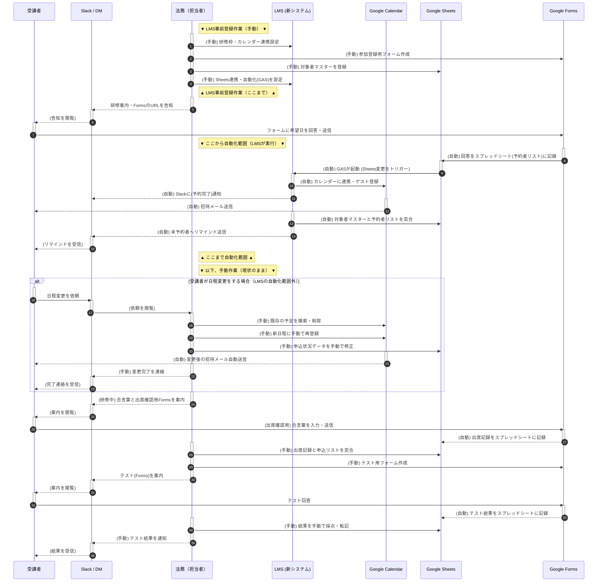

```mermaid
sequenceDiagram
    autonumber
    participant 受講者
    participant Slack / DM
    participant 法務（担当者）
    participant LMS (新システム)
    participant Google Calendar
    participant Google Sheets
    participant Google Forms

    Note right of 法務（担当者）: ▼ LMS事前登録作業（手動） ▼
    activate 法務（担当者）
    法務（担当者）->>LMS (新システム): (手動) 研修枠・カレンダー連携設定
    法務（担当者）->>Google Forms: (手動) 参加登録用フォーム作成
    法務（担当者）->>Google Sheets: (手動) 対象者マスターを登録
    法務（担当者）->>LMS (新システム): (手動) Sheets連携・自動化(GAS)を設定
    deactivate 法務（担当者）
    Note right of 法務（担当者）: ▲ LMS事前登録作業（ここまで） ▲

    activate 法務（担当者）
    法務（担当者）-->>Slack / DM: 研修案内・FormsのURLを告知
    deactivate 法務（担当者）
    activate Slack / DM
    Slack / DM-->>受講者: (告知を閲覧)
    deactivate Slack / DM
    
    activate 受講者
    受講者->>Google Forms: フォームに希望日を回答・送信
    deactivate 受講者

    Note right of 法務（担当者）: ▼ ここから自動化範囲（LMSが実行） ▼
    activate Google Forms
    Google Forms->>Google Sheets: (自動) 回答をスプレッドシート(予約者リスト)に記録
    deactivate Google Forms

    activate Google Sheets
    Google Sheets->>LMS (新システム): (自動) GASが起動 (Sheets変更をトリガー)
    deactivate Google Sheets

    activate LMS (新システム)
    LMS (新システム)->>Google Calendar: (自動) カレンダーに連携・ゲスト登録
    LMS (新システム)-->>Slack / DM: (自動) Slackに(予約完了)通知
    deactivate LMS (新システム)

    activate Google Calendar
    Google Calendar-->>受講者: (自動) 招待メール送信
    deactivate Google Calendar
    
    activate LMS (新システム)
    LMS (新システム)->>Google Sheets: (自動) 対象者マスターと予約者リストを突合
    LMS (新システム)-->>Slack / DM: (自動) 未予約者へリマインド送信
    deactivate LMS (新システム)
    
    activate Slack / DM
    Slack / DM-->>受講者: (リマインドを受信)
    deactivate Slack / DM
    Note right of 法務（担当者）: ▲ ここまで自動化範囲 ▲


    Note right of 法務（担当者）: ▼ 以下、手動作業（現状のまま） ▼
    alt 受講者が日程変更をする場合（LMSの自動化範囲外）
        activate 受講者
        受講者->>Slack / DM: 日程変更を依頼
        deactivate 受講者
        activate Slack / DM
        Slack / DM->>法務（担当者）: (依頼を閲覧)
        deactivate Slack / DM
        
        activate 法務（担当者）
        法務（担当者）->>Google Calendar: (手動) 既存の予定を検索・削除
        法務（担当者）->>Google Calendar: (手動) 新日程に手動で再登録
        法務（担当者）->>Google Sheets: (手動) 申込状況データを手動で修正
        deactivate 法務（担当者）
        
        activate Google Calendar
        Google Calendar-->>受講者: (自動) 変更後の招待メール自動送信
        deactivate Google Calendar
        
        activate 法務（担当者）
        法務（担当者）-->>Slack / DM: (手動) 変更完了を連絡
        deactivate 法務（担当者）
        activate Slack / DM
        Slack / DM-->>受講者: (完了連絡を受信)
        deactivate Slack / DM
    end

    activate 法務（担当者）
    法務（担当者）-->>Slack / DM: (研修中) 合言葉と出席確認用Formsを案内
    deactivate 法務（担当者）
    activate Slack / DM
    Slack / DM-->>受講者: (案内を閲覧)
    deactivate Slack / DM
    
    activate 受講者
    受講者->>Google Forms: (出席確認用) 合言葉を入力・送信
    deactivate 受講者
    
    activate Google Forms
    Google Forms-->>Google Sheets: (自動) 出席記録をスプレッドシートに記録
    deactivate Google Forms
    
    activate 法務（担当者）
    法務（担当者）->>Google Sheets: (手動) 出席記録と申込リストを突合
    deactivate 法務（担当者）

    activate 法務（担当者）
    法務（担当者）->>Google Forms: (手動) テスト用フォーム作成
    法務（担当者）-->>Slack / DM: テスト(Forms)を案内
    deactivate 法務（担当者）
    activate Slack / DM
    Slack / DM-->>受講者: (案内を閲覧)
    deactivate Slack / DM
    
    activate 受講者
    受講者->>Google Forms: テスト回答
    deactivate 受講者
    
    activate Google Forms
    Google Forms-->>Google Sheets: (自動) テスト結果をスプレッドシートに記録
    deactivate Google Forms
    
    activate 法務（担当者）
    法務（担当者）->>Google Sheets: (手動) 結果を手動で採点・転記
    deactivate 法務（担当者）

    activate 法務（担当者）
    法務（担当者）-->>Slack / DM: (手動) テスト結果を通知
    deactivate 法務（担当者）
    activate Slack / DM
    Slack / DM-->>受講者: (結果を受信)
    deactivate Slack / DM
```