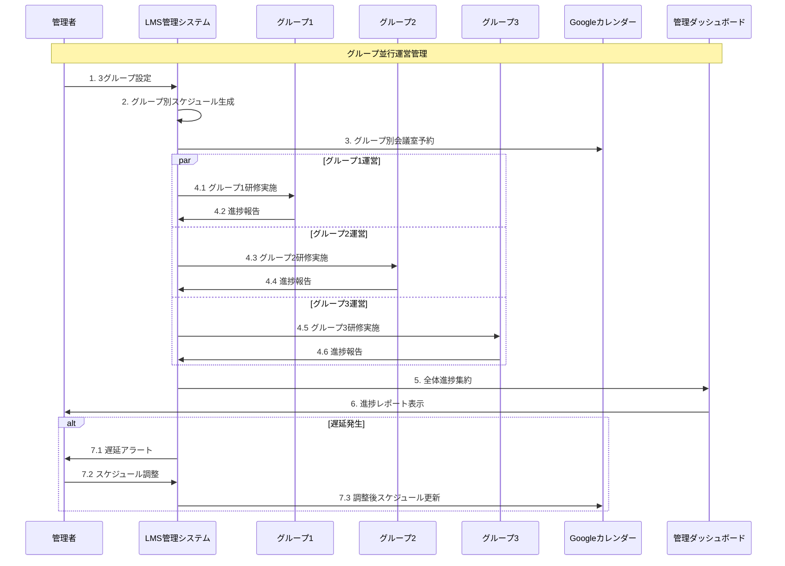
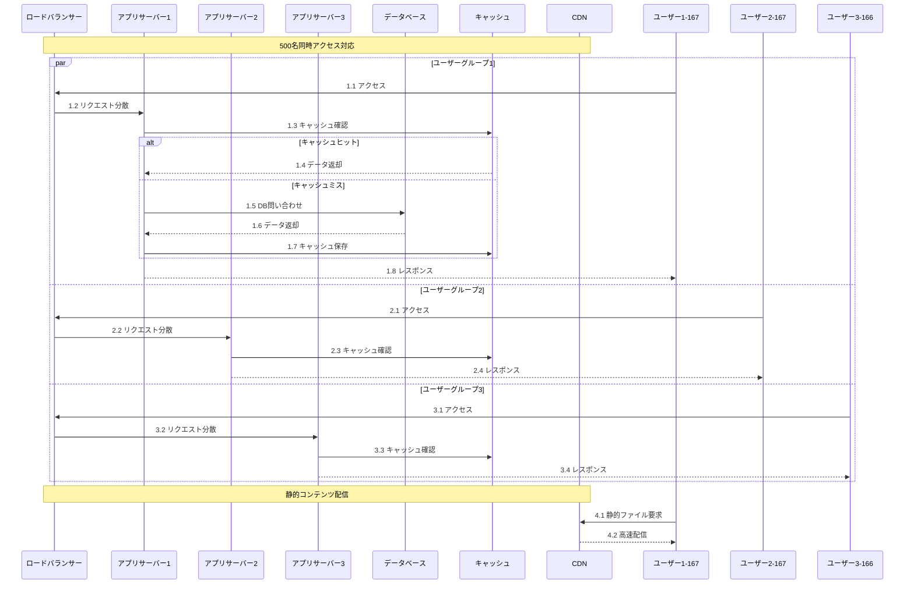
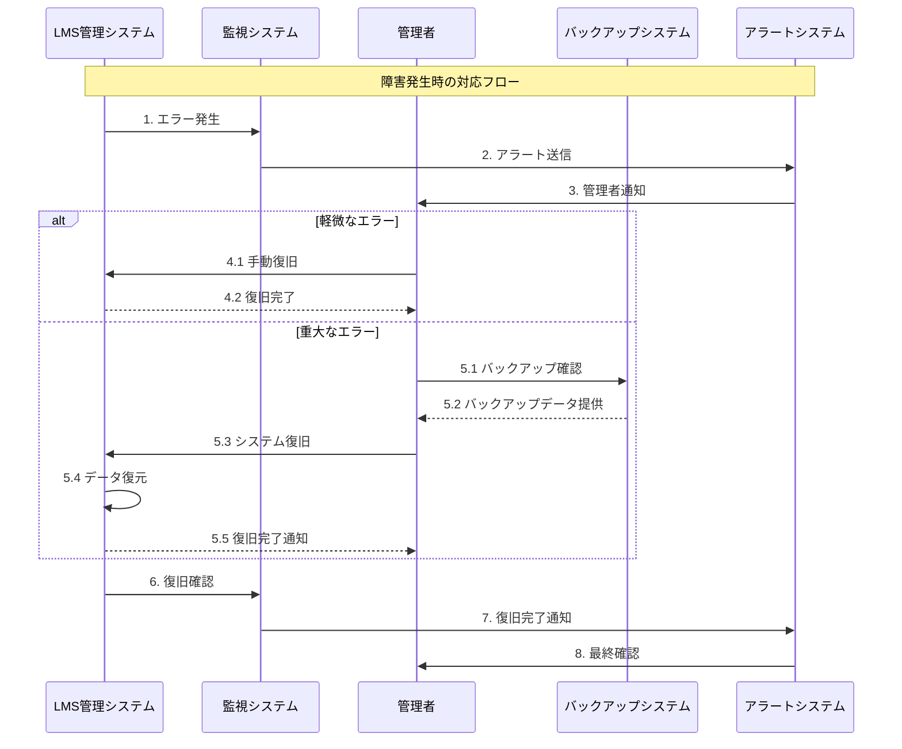
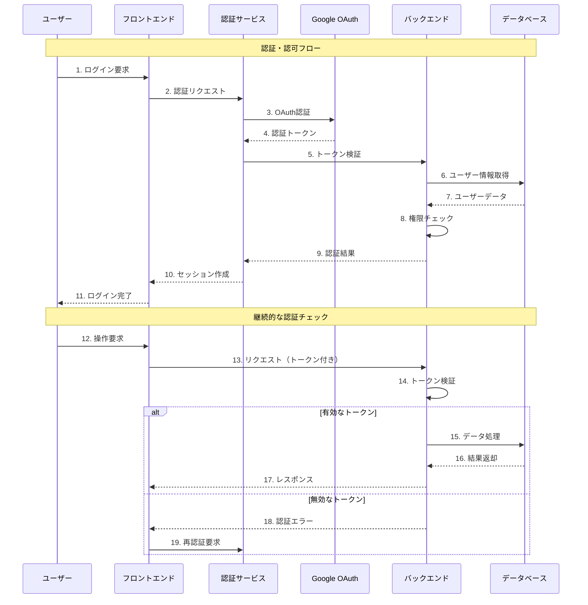

# 法務研修LMSシステム シーケンス図

## 1. 基本研修フロー（予約変更機能含む）

```mermaid
sequenceDiagram
    participant Admin as 管理者
    participant System as LMS管理システム
    participant Calendar as Googleカレンダー
    participant Participant as 受講者
    participant Notification as 通知システム
    participant Test as テストシステム

    Note over Admin, Test: 1. 初期設定フェーズ
    Admin->>System: 1.1 会議室とGoogleカレンダー作成
    System->>Calendar: 1.2 カレンダーイベント作成
    Calendar-->>System: 1.3 イベントID返却
    Admin->>System: 1.4 予定URL登録
    Admin->>System: 1.5 受講コース対象者リスト登録
    System->>System: 1.6 3グループに自動振り分け

    Note over Admin, Test: 2. 予約フェーズ
    Participant->>System: 2.1 参加希望日予約
    System->>System: 2.2 定員・スケジュール確認
    System->>Calendar: 2.3 カレンダー予約確認
    System->>Participant: 2.4 予約確認通知

    Note over Admin, Test: 3. 予約変更フェーズ（新機能）
    Participant->>System: 3.1 予約変更申請
    System->>System: 3.2 変更条件チェック<br/>（3日前まで、1回まで、同グループ内）
    alt 変更可能
        System->>Calendar: 3.3 元予約キャンセル
        System->>Calendar: 3.4 新予約作成
        System->>Participant: 3.5 変更完了通知
        System->>Admin: 3.6 変更報告
    else 変更不可
        System->>Participant: 3.7 変更拒否理由通知
    end

    Note over Admin, Test: 4. リマインドフェーズ
    System->>System: 4.1 未登録者チェック
    System->>Notification: 4.2 リマインド送信
    Notification->>Participant: 4.3 リマインド通知

    Note over Admin, Test: 5. 研修実施フェーズ
    System->>System: 5.1 研修開始
    System->>Participant: 5.2 研修URL提供
    Participant->>System: 5.3 研修参加
    System->>System: 5.4 出席記録

    Note over Admin, Test: 6. テスト・評価フェーズ
    System->>Test: 6.1 テスト開始
    Participant->>Test: 6.2 テスト回答
    Test->>System: 6.3 回答データ送信
    System->>System: 6.4 自動採点
    Admin->>System: 6.5 手動採点（必要時）
    System->>Participant: 6.6 採点結果通知

    Note over Admin, Test: 7. 補講フェーズ
    System->>System: 7.1 未受講者・不合格者特定
    Admin->>System: 7.2 補講スケジュール設定
    System->>Calendar: 7.3 補講会議室予約
    System->>Notification: 7.4 補講案内送信
    Notification->>Participant: 7.5 補講通知
    System->>System: 7.6 補講実施
    System->>Test: 7.7 再テスト実施
```

## 2. 3グループ並行運営管理フロー



## 3. 500名規模スケーラビリティ対応フロー



## 4. エラーハンドリング・復旧フロー



## 5. セキュリティ・認証フロー



## 6. 通知・リマインドシステムフロー

```mermaid
sequenceDiagram
    participant System as LMS管理システム
    participant Scheduler as スケジューラー
    participant Email as メールサービス
    participant Slack as Slack通知
    participant Participant as 受講者
    participant Admin as 管理者

    Note over System, Admin: 通知・リマインドシステム
    System->>Scheduler: 1. 通知スケジュール設定
    
    Note over System, Admin: 予約確認通知
    Scheduler->>System: 2.1 予約確認タイマー
    System->>Email: 2.2 予約確認メール送信
    Email->>Participant: 2.3 予約確認通知

    Note over System, Admin: リマインド通知
    Scheduler->>System: 3.1 リマインドタイマー
    System->>System: 3.2 未登録者チェック
    System->>Email: 3.3 リマインドメール送信
    System->>Slack: 3.4 管理者向けSlack通知
    Email->>Participant: 3.5 リマインド通知
    Slack->>Admin: 3.6 管理者通知

    Note over System, Admin: 結果通知
    System->>System: 4.1 採点完了
    System->>Email: 4.2 結果通知メール送信
    Email->>Participant: 4.3 結果通知

    Note over System, Admin: 補講案内
    System->>System: 5.1 補講対象者特定
    System->>Email: 5.2 補講案内メール送信
    System->>Slack: 5.3 補講スケジュール通知
    Email->>Participant: 5.4 補講案内
    Slack->>Admin: 5.5 補講管理通知
```

---

**作成日**: 2024年10月17日  
**バージョン**: 1.0  
**対象システム**: 法務研修LMS管理システム
