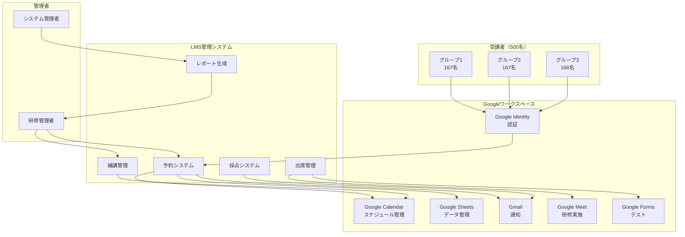
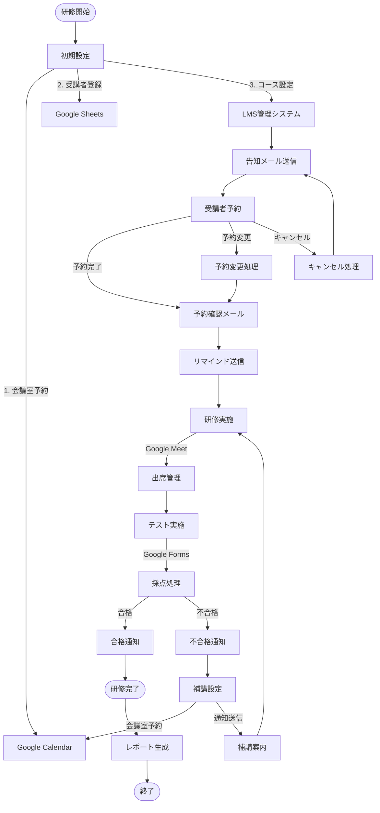
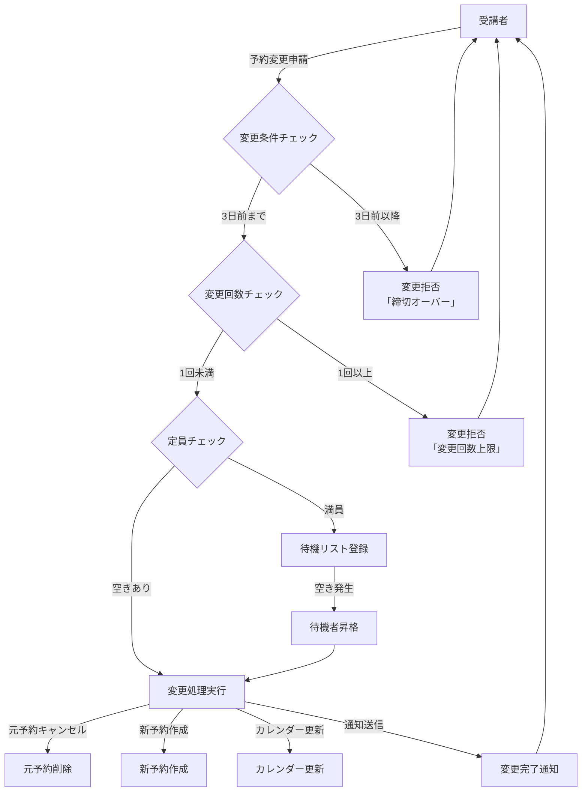
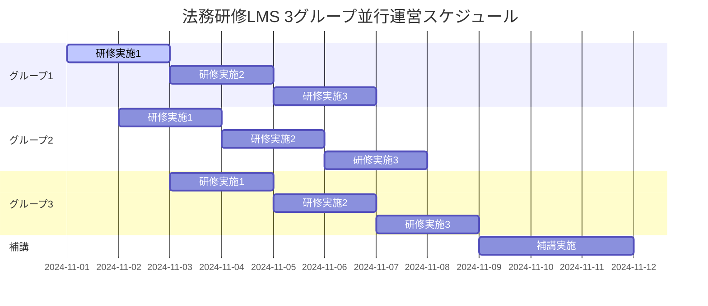
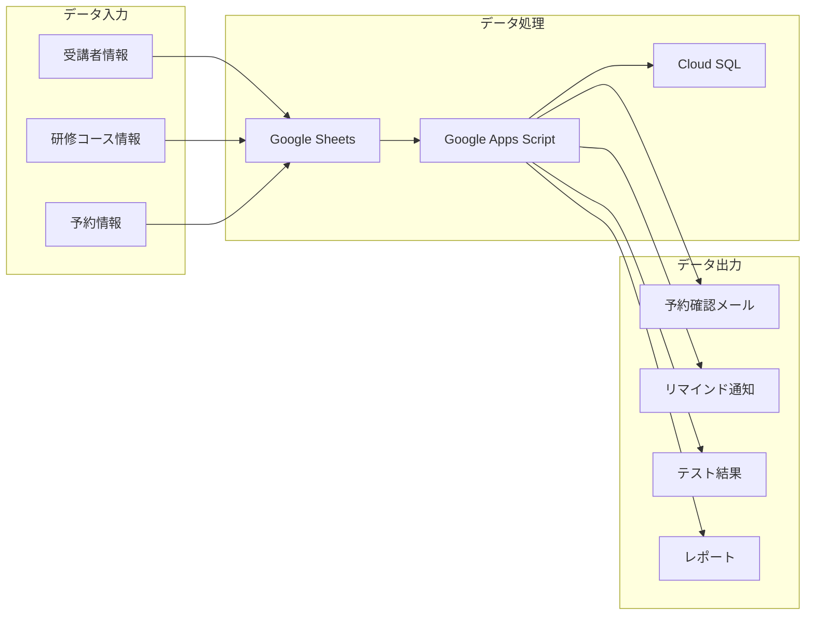
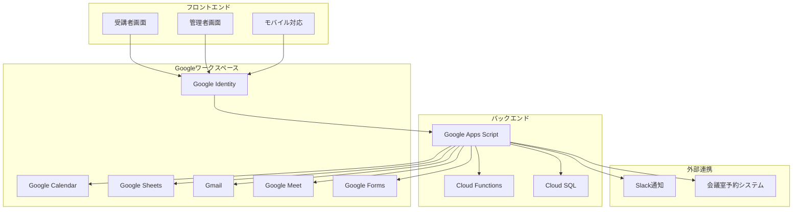
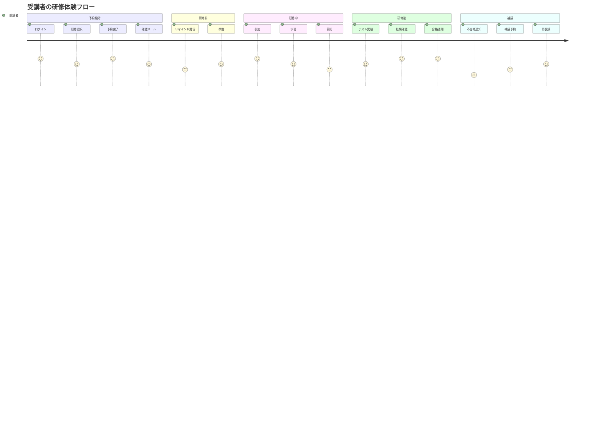
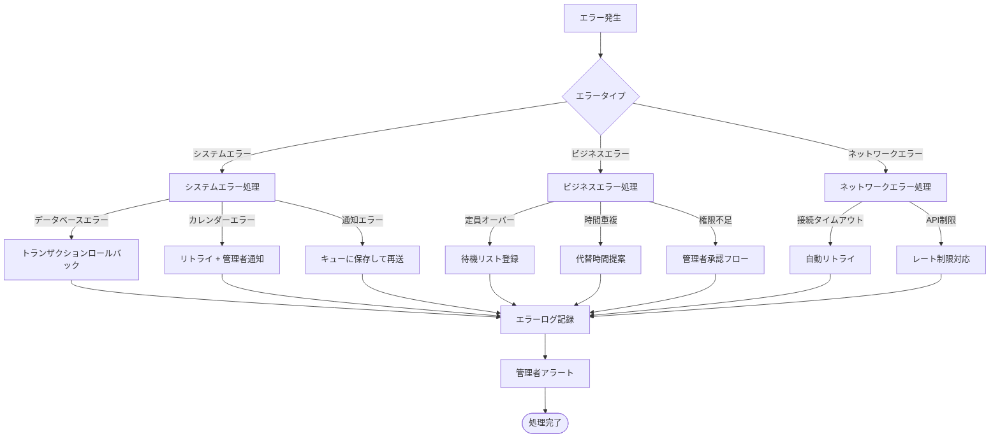
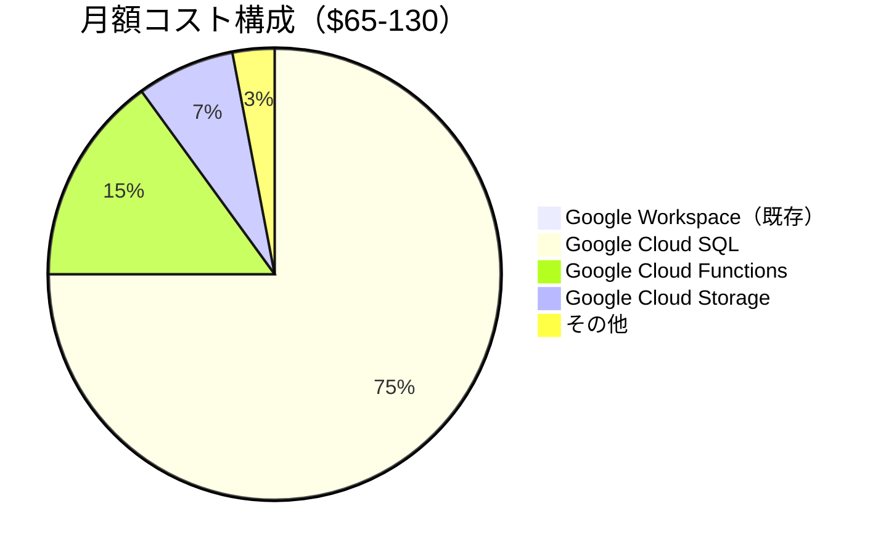
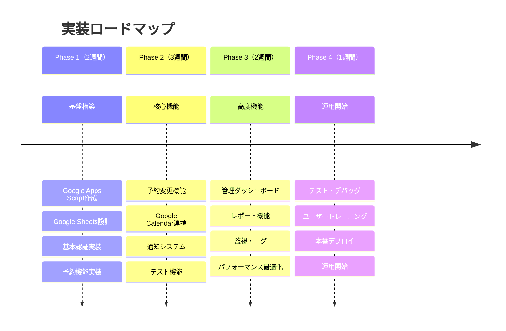

# 法務研修LMSシステム ポンチ絵（全体フロー図）

## 1. システム全体構成図

## 2. 研修フロー全体図

## 3. 予約変更フロー詳細図

## 4. 500名・3グループ並行運営図

## 5. データフロー図

## 6. システムアーキテクチャ図

## 7. ユーザージャーニーマップ

## 8. エラーハンドリングフロー

## 9. コスト構造図

## 10. 実装フェーズ図

---

**作成日**: 2024年10月17日  
**バージョン**: 1.0  
**対象**: 法務研修LMSシステム全体フロー  
**用途**: プレゼンテーション、設計レビュー、開発チーム共有
