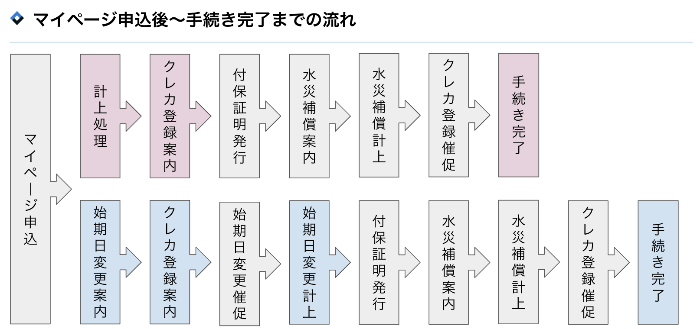
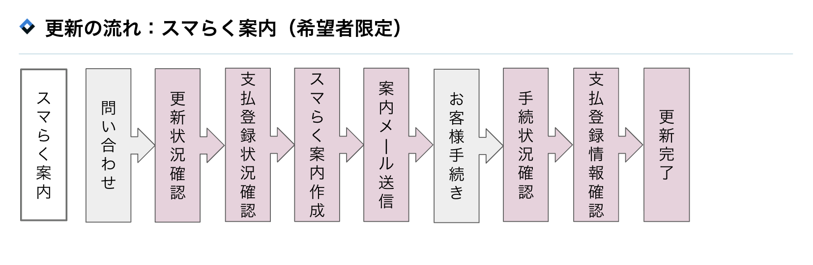
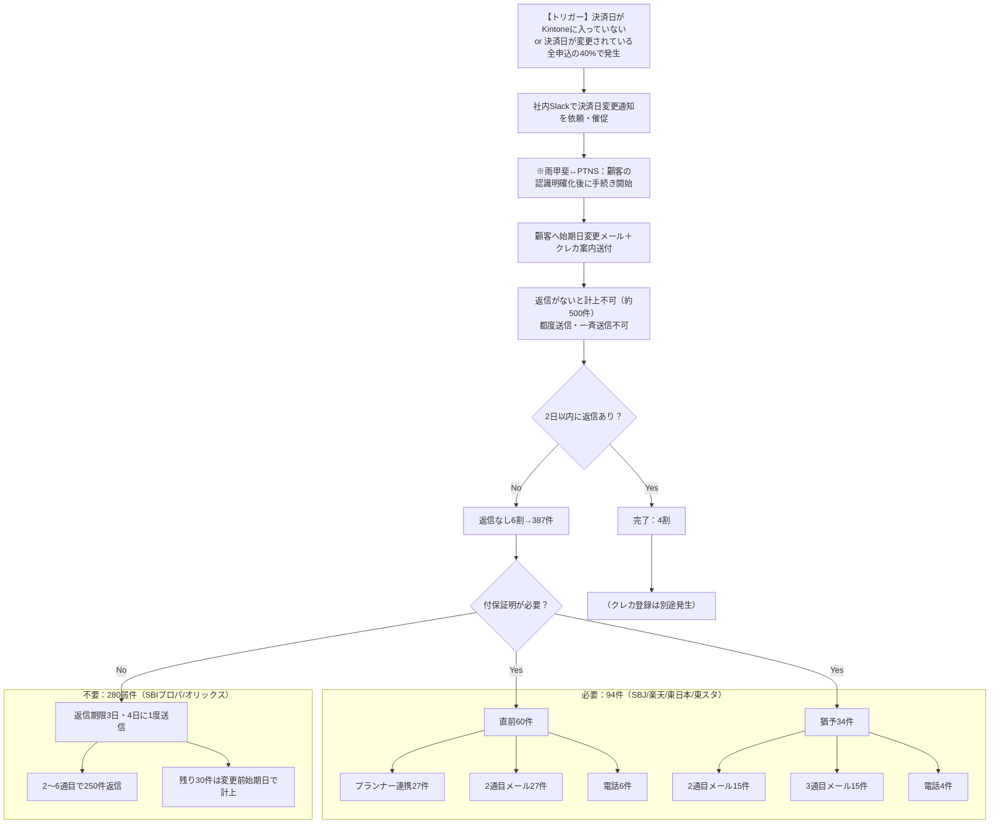

# 火災保険業務効率化

ID: 43
ステータス: 下書き
担当チーム: toB
担当プロダクト: Asset Planning
担当者: 佐藤達也

<aside>

## **エグゼクティブサマリー**

**■ なぜ今やるのか**
現状の東京海上日動（以下、東海）を主軸としたオペレーションは、件数増加に比例して「非生産的なコミュニケーション工数」が増大する**非スケーラブルな構造**である。現在対応しているPartners（以下、PTNS）からは人員抑制、事業撤退・代理店移管の要望がある一方、現行仕様では人力介入が不可避。このままではFY30に9名、FY32に13名の体制が必要となり、件数が積みあがる前の現時点で対処が必要であるため。

**■ やった時のリターン**
FY27後期より、Web完結フローを持つ日新火災（以下、日新）へ新規契約・更新を原則移行する。これにより、事務作業の約90%を保険会社側へ「構造的に移管」し、**件数が増えても3人体制を維持する運営**を実現する。FY32までの累計収支で**約2億円超のプラス**（販管費回避＋営利改善）を創出する。

**■ 投資判断**
初期投資560万円。手数料率は約40%減少するが、回避できる販管費（1,000万円×削減人数）が上回る。労働集約型モデルから脱却する。

</aside>

---

## **ISSUE（現状の課題）**

### **ターゲットユーザー**

- **Partners（以下PTNS）の火災保険業務担当者**
    
    ※ 顧客にも一定の不便を生じさせているが、機会が限定的。ISSUEとしてメインでは取り上げない
    

### **前提（業務背景）**

- 火災保険に未加入の場合、融資実行されない。そのため顧客には必ず加入いただく必要がある。
- RENOSYマイページにより契約現場でシームレスに申込まで完了でき、未加入率の抑制および契約オープン・決済ズレの防止につながる。

### **FACT / Root Cause / Damage**

- **FACT（事実）**
    - 申込から融資実行（物件引渡）までの平均期間は**約10日**。この短期間に不備なく手続きを完了させる必要がある一方、火災保険申込後の引渡日（火災保険始期日）の変更が全申込のうち **約40%** で発生する。
    - [事務ログ](https://docs.google.com/presentation/d/1FMpul7bnfzIpMYNVpIvRY7Lp8bntlbSWbnlOds-GCDU/edit?slide=id.g3b147aa32bc_0_3#slide=id.g3b147aa32bc_0_3)上の作業時間に対し、実際の稼働時間は案内・催促系のコミュニケーション工数が重く、FY25で合計6,552h（作業1,952h＋コミュ3,600h）、必要人数は3人だが今後は増加しFY32に13人必要となる見込み。
    - 属人的な対応に依存していたことから、主要メンバー**1名の離職**により、PTNSから事業撤退や代理店移管の要請が検討されるほど、継続性が危うい状態にある。
- **Root Cause（要因）**
    - **始期日変更の業務ルールによる全工程のやり直し：**
    東海の現行の業務ルールでは、計上前の始期日変更についてメールまたは電話による契約者確認が必須であり、簡略化は困難と回答されている（2025年12月時点）。そのため、日付変更のたびに**始期日変更案内→催促→計上**の全工程を手作業でやり直す必要がある。
    - **システム間連携の欠如による手動同期：**
    申込以降、自社システムと東海システムは連携しておらず、始期日変更データはINSPIRE APIを経由せず手動でTnetに流し込む。担当者が営業・顧客・保険会社の間でメールや電話により情報を繋ぎ直す手作業が発生している。
- **Damage（影響）**
    
     **→ 件数が増えるほど「利益」が減り、「事故リスク」が高まる**
    
    - 今のやり方は「変更のたびに全作業をやり直す」ため、件数が増えるほど再作業が増加する。FY32には **13名（人件費1.3億円）** が必要となる見込み。
    - 複雑なやり直し作業を個人の記憶やメール管理に頼っているため、一人の欠員やミスが即、保険発行の遅延を招く。結果として**「融資実行不可（＝決済ズレや契約オープン）」が発生**してしまう。

---

## **USER SCENARIO**

### **ユーザーストーリー**

- 日新のWeb完結フローを採用することで、始期日変更・クレカ案内・保全・更新の督促業務が保険会社側に移管され、PTNSの担当者は計上や付保証明など最小限の事務のみ対応する。
- 顧客は契約現場（マイページ）でWeb申込・クレカ登録を一度に完了し、決済後の二度手間がなくなる。引渡日変更が発生しても保険会社が窓口となり、PTNSの案内・催促・再計上が不要になる。

### **日新火災への切り替えによる「工数移管」**

| 項目 | 現行（東京海上） | 改革案（日新火災） | 変化のポイント |
| --- | --- | --- | --- |
| **事務の主体** | 顧客↔︎PTNS（代理店）↔︎保険会社 | 顧客 ↔ 保険会社 | PTNSの介入を排除 |
| **変更対応** | 手動で再計上・再案内 | 保険会社が対応窓口になる | 調整工数の消滅 |
| **督促業務** | PTNSから電話・メール | 保険会社のリマインド | コミュニケーション債務の解消 |
| **クレジットカード登録** | 決済引渡後に設定 | Web申込時に設定 | 契約時のフロー内で完了 |

---

## **IMPACT（定量的・定性的効果）**

### サマリー

|  | 現状維持 (FY30) | 日新火災移行 (FY30) | 差分 |
| --- | --- | --- | --- |
| **運営体制** | 9名（コスト9,000万円） | **3名※（コスト3,000万円）** | **▲6名 / ▲6,000万円** |
| **年間工数** | 19,770時間（作業6,348h＋コミュ13,422h） | 682時間 | **▲19,088時間** |
| **対応業務** | 自社で全て対応 | 一部を除き、火災保険会社が対応 | BCPのリスク減 |
| **顧客体験** | 引渡後にアナログ後追い | Webで事前完結 | ストレスゼロへ |

## 定量

### **上位目標 (GOAL)**

**「FY30においても現状の3人体制以下での運営」を実現**

- **工数削減：年間約19,000時間超（作業＋コミュニケーション合計の約96%を削減）**
- リソース解放：最大6名分のリソースを他事業へ再配置可能（FY30時点）

※理論上の事務工数は1名分だが、例外対応および組織の継続性（BCP）を考慮し、3名体制をミニマムとする

### **主要成果指標 (KEY METRICS)**

- 保険代理店手数料：申込/更新1件あたり**3,197円**
- 始期日変更・クレカ案内工数：年間1,297時間 → 0時間
- 工数年間3,517時間（保全2,316h + 更新1,201h）→ 0時間
- 必要人員数の抑制：FY30の予測9名 → 3名を維持
- 火災保険申込率 →：100%

### **計測の仕方**

- 各業務の月次業務時間ログ
    - 該当タスク（始期日変更、クレカ案内等）が発生していないか
    - 日新火災切り替えの更新業務工数が大きく膨らんでいないか
- 申込率
    - 日新火災のWeb見積・申込サイト経由でのWeb完結にエラーが生じていないか

## **定性**

- **BCPの強化**：属人性の排除により、担当者の離脱リスクを最小化する。
- **顧客体験向上：** 決済後にクレジットカード登録の二度手間を発生させず、マイページ契約時点でwebから申込・クレジットカード登録を完了する。

## **短期経営KPIへの寄与**

- [ ]  新規成約人数の増加
- [ ]  LTV向上
- [x]  CAC抑制：人件費抑制による火災保険事業の利益構造改善
- [ ]  粗利率の確保
- [ ]  CCCの短縮
- [ ]  安心
- [ ]  品揃え

---

# **Appendix**

### FY25実績：年間工数に対する今後の推移予測

**◆ 火災保険業務の年間作業工数詳細**

| 項目 | FY25実績 | FY26 | FY27 | FY28 | FY29 | FY30 | FY31 | FY32 | 備考 |
| --- | --- | --- | --- | --- | --- | --- | --- | --- | --- |
| **申込件数** | **7,000件** | **8,800件** | **10,550件** | **12,600件** | **15,120件** | **18,150件** | **21,964件** | **26,579件** | YoY+20%試算 |
| **累計契約数** | 31,722件 | 38,722件 | 47,522件 | 58,072件 | 70,672件 | 85,792件 | 103,942件 | 125,906件 | - |
| **新規** | 1,092(h)＋コミュ3,600(h) | 1,373(h)＋コミュ4,524(h) | 1,646(h)＋コミュ5,423(h) | 1,966(h)＋コミュ6,477(h) | 2,359(h)＋コミュ7,772(h) | 2,831(h)＋コミュ9,330(h) | 3,426(h)＋コミュ11,298(h) | 4,146(h)＋コミュ13,662(h) | 申込から正式見積発行・計上作業 |
| **保全** | 860(h)＋コミュ1,000(h) | 1,046(h)＋コミュ1,217(h) | 1,283(h)＋コミュ1,493(h) | 1,568(h)＋コミュ1,824(h) | 1,908(h)＋コミュ2,221(h) | 2,316(h)＋コミュ2,695(h) | 2,806(h)＋コミュ3,265(h) | 3,399(h)＋コミュ3,957(h) | 契約情報の変更・証明書の再発行 |
| **更新** | 発生せず | 5.7(h)＋コミュ7(h) | 43.8(h)＋コミュ51(h) | 582.2(h)＋コミュ677(h) | 1,027.2(h)＋コミュ1,195(h) | 1,201.2(h)＋コミュ1,397(h) | 881.8(h)＋コミュ1,025(h) | 1,057.1(h)＋コミュ1,229(h) | 顧客情報の変更・解約手続き |
| **合計時間** | 約6,552h | 約8,173h | 約9,940h | 約13,094h | 約16,482h | 約19,770h | 約22,702h | 約27,450h | 作業＋コミュニケーション合計 |
| **必要人数** | 3人 | 4人 | 5人 | 6人 | 8人 | 9人 | 11人 | 13人 | 合計時間÷2,184h/人 |

**◆ 計算根拠**:

- 1人あたりの年間稼働時間：2,184時間/人（FY25実績：合計6,552h÷3人）
- 必要人数：合計時間（作業＋コミュニケーション）÷2,184で算出
- 新規業務：年間契約件数 × 平均9.4分/件（FY25実績：1,092時間 ÷ 7,000件 = 約0.156時間/件）
- 保全業務：累計契約数 × 平均1.6分/件（FY25実績：860時間 ÷ 31,722件 = 約0.027時間/件）
- **新規のコミュニケーション**（パートナーズ資料FY25実績＋催促系）：案内系649h（クレカ登録案内353h、始期日変更案内147h、スマらく案内108h、水災補償案内29h、取消・その他11h）＋催促系2,951h（3,600h－649h。2人フル稼働150h/月×12×2＝3,600hのうち案内以外）＝3,600h。申込件数に比例（3,600h÷7,000件＝約0.514h/件）で将来年度を按分
- **保全のコミュニケーション**（伊藤さん2026年2月ヒアリング）：1日あたりの内訳（宛先不明追跡1.5h、住所変更1h、解約1h、案内分計上0.5h、その他+α）＝約4h。4h×250営業日＝1,000h/年（保全担当1人分）。保全案件数（累計契約数に比例）に応じて按分、係数＝1,000h÷5,160件≈0.194h/件
    - **根拠（2026年2月伊藤さん確認）**: 東京海上からの年間対応依頼は約5,160件（2026年1月実績430件×12）。伊藤さん感覚から、保全1件あたり約10分で試算。5,160件 × 10分/件 ≈ 860時間
- **更新のコミュニケーション**：保全と同様のお客様対応（催促・宛先不明連絡等）があり、作業時間に対する比率を保全と同じ約1.16倍で試算（保全：作業860hに対しコミュ1,000h）
- 更新業務：(5年前の申込件数×60%) × 平均10.0分/件
    - **更新件数**: [Partners資料の「満期更改予測」](https://docs.google.com/presentation/d/1FMpul7bnfzIpMYNVpIvRY7Lp8bntlbSWbnlOds-GCDU/edit?slide=id.g3b1436f5c15_0_382#slide=id.g3b1436f5c15_0_382)の件数を使用
    - **前提**: お客様は基本的に更新する（更新率は100%に近い）が、60%の確率で手動対応が必要

### 補足：過去の申込件数（5年前の契約件数ベース）

- FY20: マイページ未対応 → FY26更新予測: 34件
- FY21: マイページ未対応 → FY27更新予測: 262件
- FY22: 4,177件 → FY28更新予測: 3,486件
- FY23: 5,221件 → FY29更新予測: 6,151件
- FY24: 5,908件 → FY30更新予測: 7,193件

### 火災保険業務の具体的な対応フロー

- 新規申込
    - 下の変更案内〜

- 保全（多岐に渡るため記載を割愛、下記リンク）

[https://docs.google.com/presentation/d/1FMpul7bnfzIpMYNVpIvRY7Lp8bntlbSWbnlOds-GCDU/edit?slide=id.g3b1436f5c15_0_416#slide=id.g3b1436f5c15_0_416](https://docs.google.com/presentation/d/1FMpul7bnfzIpMYNVpIvRY7Lp8bntlbSWbnlOds-GCDU/edit?slide=id.g3b1436f5c15_0_416#slide=id.g3b1436f5c15_0_416)

- 更新

### 補足：始期日変更時（メール催促系）のオペレーションフロー

**補足**: クレカ登録は別途発生。

**保全の宛先不明追跡も同様の流れ**: 宛先不明追跡（電話・郵送で掘り起こし）の結果が、住所変更・解約・案内分の計上のいずれかに分類される。件数としては後者3項目の合計がユニーク件数となる（月430件との整合）。

### 1. 東京海上日動側も「簡略化は困難」と回答

Partnersの担当者から東京海上日動へ対して「始期日変更手続きの簡素化」を要望した際、2025年12月時点での回答は以下の通りでした:

- **基本ルール**：計上前の始期日変更は、メールか電話で契約者に確認することが必須。
- **現状**：その対応を省略・簡略化することは難しい状況。

これにより、システム上で「1日ずらすだけ」の処理は認められず、都度「人力を介した確認と再手続き」が必要であることが公的な回答として記録されています。

### 2. 現行システムの構造的制約

その他の内部資料においても、以下の点が「Root Cause（要因）」として特定されています:

- **決済フローの分断**：マイページ申込とクレジットカード登録の手続きが別々になっており、変更のたびに手続きがバラバラになる 。
- **手動送信の常態化**：クレジットカード登録案内などを1件ずつ手動で送信しており、変更が発生するたびにこの手作業が再発する 。

対応管理はKintoneでやっている。申込単位でレコードがあり、現状の進捗が管理できるツール。月末に池田さんが整理。

それぞれの対応はパターン分けで対応。

- 始期日変更：池田さん
- クレカ登録：伊藤さん
- マイページ計上は二人で分担

### **今後の営利推移予測**

**前提：**

- 代理店手数料の料率は、保険販売件数に応じて設定される。料率は最高設定となっている。
    - 平均保険料：22,771円
    - 手数料率(地震・火災保険合わせての標準値)：約23.6%
    - 手数料：平均 4,857円/件
- 更新手数料単価：新規と同じ（約4,857円/件）と仮定
- 販管費（人件費含む）：1人あたり1,000万円/年が発生している。内訳は下記の通り。
    - 人件費: 630万円
    - その他販管費用（福利厚生・オフィスなど）：370万円
    
    |  | 申込件数 | 更新件数 | PTNSが受け取る手数料 | 必要人数 | 販管費（人件費含む） | **営利** |
    | --- | --- | --- | --- | --- | --- | --- |
    | **FY25実績** | 7,000件 | 0件 | **3,400万円** | 3人 | **3,000万円** | **400万円** |
    | FY26 | 8,800件 | 34件 | 4,291万円 | 5人 | 5,000万円 | **▲709万円** |
    | FY27 | 10,550件 | 262件 | 5,251万円 | 6人 | 6,000万円 | **▲749万円** |
    | FY28 | 12,600件 | 3,486件 | 7,813万円 | 8人 | 8,000万円 | **▲187万円** |
    | FY29 | 15,120件 | 6,151件 | 10,331万円 | 10人 | 10,000万円 | **331万円** |
    | FY30 | 18,150件 | 7,193件 | 12,309万円 | 9人 | 9,000万円 | **3,309万円** |
    | FY31 | 21,964件 | 5,280件 | 13,232万円 | 13人 | 13,000万円 | **232万円** |
    | FY32 | 26,579件 | 6,330件 | 15,984万円 | 13人 | 13,000万円 | **2,984万円** |

**分析**:

- 必要人数は作業工数＋コミュニケーション工数の合計を2,184h/人で除して算出（FY25実績ベース）。FY30は9名、FY32は13名となる見込み。現状維持では販管費が手数料の大半を占めるが、営利はプラスで推移する。

### **業務負荷改善案とその評価案（FY32時点）**

| 対策案 | 概要 | 想定効果 | 想定コスト | その他懸念事項 | 優先度 |
| --- | --- | --- | --- | --- | --- |
| **A.日新火災への完全移行（新規契約のみ）** | 新規契約を東京海上日動→日新火災にすることで、クレジットカード登録案内・始期日変更・保全/更改業務を行わなくする | クレジットカード登録案内・始期日変更・保全/更改業務なし、引き渡し前決済の実現可能性 | 開発コスト：560万円（前回Inspire連携実績ベース） | GAが代理店に入る必要がある※GAのマイページと紐づけるために代理店登録している | 最優先 |
| **B.全件スマらく案内への切り替え（マイページ申込の停止）** | 決済日が確定してから案内できるため、始期日変更・クレカ案内をなくす | 始期日変更・クレカ案内なし | マイページ申込の停止によるデジタル完結手続きの利便性低下 | 属人的なオペレーションは継続、契約時に申込ができないため保険未加入リスク | 中 |
| **C.RENOSY事業の一部に体制変更** | 対応者（保険募集人資格保持者）を増やす。シンプルな事務処理は特に資格不要。 | 処理件数増に対応 | 人員コストの増加 | 人員コストの増加が避けられない | 中 |
| **D.東京海上への保全対応の移管** | 東京海上の代理店サポートチームに依頼する。 | 保全業務なし | 手数料40%減を許容する必要がある | 対応検討中。時期・詳細不明 | 低 |
| **E.フレックスへの完全移行** | 永守さん在職の会社（現在免許の申請中）への移行 | クレジットカード登録案内・始期日変更・保全/更改業務なし | 時期不明 | 免許申請中のため、実現時期が不確定 | 低 |

### **改善案ごとの業務変化（FY32時点）**

| 項目 | 何もしない（現状維持） | A: 日新火災への完全移行 | B: スマらく案内への切替 | C: RENOSY事業の一部に体制変更 |
| --- | --- | --- | --- | --- |
| **新規** | 4,146時間 | **約266時間**※始期日変更催促のみ、1件あたり0.01時間程度 | **約2,245時間** | 4,146時間 |
| **保全** | 3,399時間 | **0時間** | 3,399時間 | 3,399時間 |
| **更新** | 1,057時間 | **0時間** | 1,057時間 | 1,057時間 |
| **始期日変更・クレカ案内** | 1,899時間 | **0時間** | **0時間** | 1,899時間 |
| **人件費削減効果** | なし | FY27-FY32 累計で**37,000万円** | FY27-FY32 累計で**8,225万円** | **PTNSとしてはゼロに** |
| **手数料減** | なし | FY27-FY32 累計で**▲23,820万円** | なし | **PTNSとしてはゼロに** |
| **開発費** | なし | **▲560万円** | **▲200万円** | なし |

### **日新火災への完全移行をした場合のシミュレーション**

- 手数料減少率：約38.6%（東京海上23.6% → 日新火災14.0%）
- 開発費：560万円（FY27）
- 日新火災側のシステム改修が必要であるため、FY27後期から開始

### **工数と必要人数の比較**

**注**：FY27後期から日新火災への切り替えを開始するため、FY26は現状維持のみを記載。移行後の数値はFY27以降から記載。現状必要人数は作業＋コミュニケーション工数の合計を2,184h/人（FY25実績）で除した値。

| 年度 | 申込件数 | 更新件数 | 現状工数 | 現状必要人数 | 日新火災移行後（工数） | 日新火災移行後（必要人数） | 削減人数 |
| --- | --- | --- | --- | --- | --- | --- | --- |
| FY26 | 8,800件 | 34件 | 2,425時間 | 5人 | - | - | - |
| FY27 | 10,550件 | 262件 | 2,973時間 | 6人 | 606時間 | 3人 | 3人 |
| FY28 | 12,600件 | 3,486件 | 4,116時間 | 8人 | 626時間 | 3人 | 5人 |
| FY29 | 15,120件 | 6,151件 | 5,294時間 | 10人 | 652時間 | 3人 | 7人 |
| FY30 | 18,150件 | 7,193件 | 6,348時間 | 9人 | 682時間 | 3人 | 6人 |
| FY31 | 21,964件 | 5,280件 | 7,114時間 | 13人 | 720時間 | 3人 | 10人 |
| FY32 | 26,579件 | 6,330件 | 8,602時間 | 13人 | 766時間 | 3人 | 10人 |

### 完全移行した場合の営利推移予測

**前提**: 日新火災への切り替えはFY27後期から開始。FY26は現状維持。FY27は前期移行前・後期移行後の半年ずつを合算。手数料率は東京海上23.6%→日新火災14.0%で約38.6%減。

**計算式**（単位：万円）:
- **単年営利 = 移行後手数料 − 移行後販管費 − 開発費**
- 移行後手数料 = 現状手数料 − 手数料減少額（東京海上23.6%→日新14.0%で約38.6%減）
- 移行後販管費 = 必要人員 × 1,000万円/年（半年分は50%で按分）

※現状手数料・移行後手数料は「PTNSが受け取る手数料」の水準。営利表の手数料列と同値。FY27の手数料減少※は後期（移行後）の半年分のみ。

| 年度 | 申込件数 | 更新件数 | 現状手数料 | 手数料減少 | 移行後手数料 | 必要人員 | 移行後販管費 | 開発費 | 単年営利 | 累計収支 | 現状維持の営利 | 現状維持の累計 |
| --- | --- | --- | --- | --- | --- | --- | --- | --- | --- | --- | --- | --- |
| FY26 | 8,800件 | 34件 | 4,291万円 | 0 | （移行前） | 5名 | （移行前） | 0 | ▲709万円 | ▲709万円 | ▲709万円 | ▲709万円 |
| FY27 | 10,550件 | 262件 | 5,251万円 | ▲1,014万円※ | 4,238万円 | 前期6名/後期3名 | 4,500万円 | 560万円 | ▲823万円 | ▲1,532万円 | ▲749万円 | ▲1,458万円 |
| FY28 | 12,600件 | 3,486件 | 7,813万円 | ▲3,016万円 | 4,797万円 | 3名 | 3,000万円 | 0 | 1,797万円 | 265万円 | ▲187万円 | ▲1,646万円 |
| FY29 | 15,120件 | 6,151件 | 10,331万円 | ▲3,988万円 | 6,343万円 | 3名 | 3,000万円 | 0 | 3,343万円 | 3,608万円 | 331万円 | ▲1,315万円 |
| FY30 | 18,150件 | 7,193件 | 12,309万円 | ▲4,751万円 | 7,558万円 | 3名 | 3,000万円 | 0 | 4,558万円 | 8,166万円 | 3,309万円 | 1,994万円 |
| FY31 | 21,964件 | 5,280件 | 13,232万円 | ▲5,108万円 | 8,124万円 | 3名 | 3,000万円 | 0 | 5,124万円 | 13,290万円 | 232万円 | 2,226万円 |
| FY32 | 26,579件 | 6,330件 | 15,984万円 | ▲6,170万円 | 9,814万円 | 3名 | 3,000万円 | 0 | 6,814万円 | 20,104万円 | 2,984万円 | 5,210万円 |
